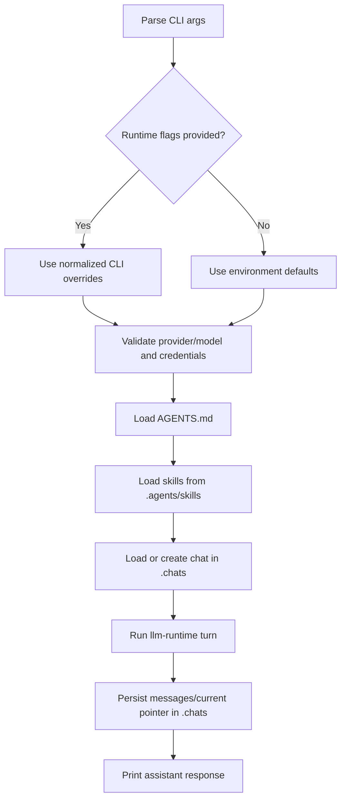

# AP: codex-copilot-convention

- Story slug: `codex-copilot-convention`
- Created: `2026-05-07`
- Status: Implemented
- Related requirement: `./.docs/reqs/2026/05/07/req-codex-copilot-convention.md`

## Goal

Migrate Agent CLI conventions to codex/copilot defaults by switching prompt and skill roots, retiring local JSON runtime config, introducing environment documentation, and moving chat persistence into a hidden top-level storage root.

## Assumptions

1. The existing CLI flags remain the primary explicit runtime override mechanism.
2. Runtime environment fallback continues to rely on process environment variables.
3. Legacy `./agent/sessions` content does not require automatic migration in this scope.
4. Existing tests can be updated in place to validate the new file paths and configuration behavior.

## Proposed Structure

1. Path constants migrate from `./agent/*` to codex/copilot layout:
   - System prompt: `./AGENTS.md`
   - Skills root: `./.agents/skills/`
   - Chat root: `./.chats/`
2. Agent config loader is retired from runtime flow:
   - Remove `./agent/config.json` loading from CLI startup.
   - Keep command-line parsing and normalization for runtime flags.
   - Preserve env-based fallback through runtime validation logic.
3. Session store writes current pointer and chat artifacts under `./.chats/`:
   - `./.chats/current.json`
  - `./.chats/{chatId}/messages.json`
  - `./.chats/{chatId}/events.json`
4. Documentation and fixtures are updated to reflect new conventions.
5. Add `./.env.example` with required and optional provider variables.

## Data Model

### Current Chat Pointer

File: `./.chats/current.json`

```json
{
  "chatId": "20260507T120000Z-abc123"
}
```

### Chat Messages File

File: `./.chats/<chat-id>/messages.json`

```json
{
  "id": "20260507T120000Z-abc123",
  "createdAt": "2026-05-07T12:00:00.000Z",
  "updatedAt": "2026-05-07T12:01:00.000Z",
  "messages": [
    {
      "role": "user",
      "content": "hello",
      "createdAt": "2026-05-07T12:00:10.000Z"
    },
    {
      "role": "assistant",
      "content": "hi",
      "createdAt": "2026-05-07T12:00:15.000Z"
    }
  ]
}
```

## Implementation Phases

- [x] Phase 1: Update core paths and file loaders.
  - Replace path constants for system prompt, skills root, and sessions root.
  - Ensure system prompt loading resolves `./AGENTS.md`.
  - Ensure skill discovery resolves recursive `SKILL.md` under `./.agents/skills/`.

- [x] Phase 2: Retire `config.json` runtime source.
  - Remove runtime callsites that read `./agent/config.json`.
  - Keep CLI runtime flags and normalization behavior.
  - Keep environment-variable fallback behavior in runtime validation.
  - Keep `lib/agent-config.js` only if used for CLI flag normalization; otherwise delete.

- [x] Phase 3: Move persistence to `./.chats`.
  - Update session-store path usage to `./.chats`.
  - Preserve same JSON schema and atomic-write behavior.
  - Update tests and fixtures to assert `./.chats` outputs.

- [x] Phase 4: Update docs and developer onboarding.
  - Update `README.md` to new prompt, skills, and storage paths.
  - Document runtime precedence as: CLI flags, then environment variables.
  - Add `./.env.example` with provider variable templates and comments.

- [x] Phase 5: Validate via test suite.
  - Run unit tests and e2e tests.
  - Verify no lingering references to retired `./agent/config.json` and `./agent/sessions` paths in runtime behavior.

## Execution Flow



## Architecture Review

### Outcome

The plan is sound and minimal for the requested migration. No major architecture flaws remain for this scope.

### Checks

1. The migration centralizes convention changes in `paths.js`, reducing blast radius.
2. Retiring `config.json` removes ambiguous precedence and aligns behavior with codex/copilot expectations.
3. Storage relocation keeps schema stable, lowering migration risk to path-only changes.

### Tradeoffs

1. Dropping persisted non-secret config reduces convenience for local defaults but increases portability and predictability.
2. Not auto-migrating old `./agent/sessions` data simplifies implementation but may require manual carryover for existing users.

### Risks To Watch During SS

1. Tests that hardcode legacy `./agent/*` paths may fail until all fixtures are updated.
2. Users with existing `./agent/config.json` may assume it still applies; docs must be explicit.
3. E2E tests must remain stable when prompt and skill roots move.
