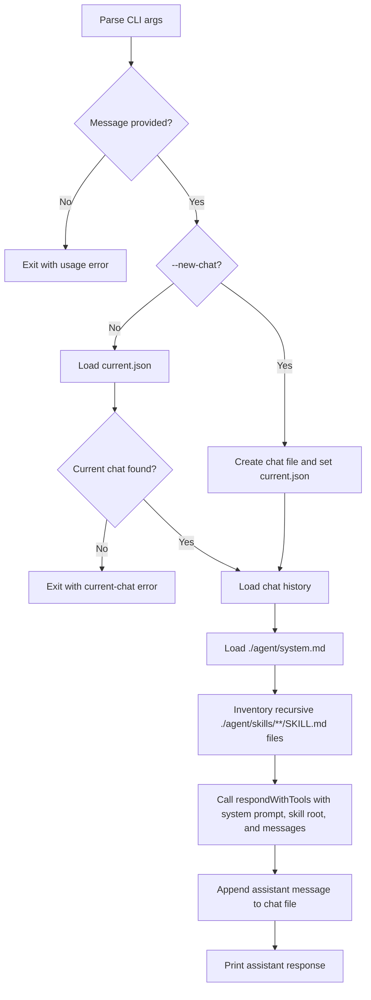

# AP: llm-runtime-cli

- Story slug: `llm-runtime-cli`
- Created: `2026-05-07`
- Status: Superseded
- Related requirement: `./.docs/reqs/2026/05/07/req-llm-runtime-cli.md`
- Superseded by: `./.docs/plans/2026/05/07/plan-codex-copilot-convention.md`

## Supersession Note

This plan describes the original `./agent/*` structure.
Current implementation conventions are tracked in `plan-codex-copilot-convention`.
Keep this plan for historical traceability only.

## Goal

Implement a Node.js CLI that sends a user message to the current persisted chat using `llm-runtime`, with system prompt loading from `./agent/system.md`, skill loading from `./agent/skills/`, and session persistence under `./agent/sessions`.

## Assumptions

1. The repository will stay on CommonJS unless `llm-runtime` forces ESM interop changes.
2. The CLI can use JSON files for persisted session state.
3. The first implementation only needs to support single-process local usage.
4. An existing but empty `./agent/skills/` directory is valid.

## Proposed Structure

1. Add a CLI entry point script that parses positional message input and the `--new-chat` flag.
2. Add a small session storage module responsible for creating chat IDs, loading the current chat pointer, reading/writing chat JSON files, and updating `current.json`.
3. Add a prompt-loading module responsible for reading `./agent/system.md`, validating the `./agent/skills/` skill root, and inventorying recursive `SKILL.md` files for operator visibility.
4. Add an LLM orchestration module that combines the system prompt, the `llm-runtime` skill root, and persisted message history into one `respondWithTools(...)` chat request.
5. Wire the package manifest so the CLI can be run as a project command.

## Data Model

### Current Chat Pointer

File: `./agent/sessions/current.json`

```json
{
  "chatId": "20260507T120000Z-abc123"
}
```

### Chat File

File: `./agent/sessions/chats/<chat-id>.json`

```json
{
  "id": "20260507T120000Z-abc123",
  "createdAt": "2026-05-07T12:00:00.000Z",
  "updatedAt": "2026-05-07T12:01:00.000Z",
  "messages": [
    {
      "role": "user",
      "content": "How should I think about index funds?",
      "createdAt": "2026-05-07T12:00:10.000Z"
    },
    {
      "role": "assistant",
      "content": "Start with cost, diversification, and tax placement.",
      "createdAt": "2026-05-07T12:00:15.000Z"
    }
  ]
}
```

## Implementation Phases

- [x] Phase 1: Add dependency and package wiring.
  - Add `llm-runtime` to `package.json`.
  - Add a runnable CLI command and executable entry configuration using package-level ESM `.js` files.

- [x] Phase 2: Add agent file loading.
  - Read `./agent/system.md` with clear missing-file errors.
  - Enumerate recursive `SKILL.md` files under `./agent/skills/` in lexical path order.
  - Return an empty skill list when the directory exists but has no loadable `SKILL.md` files.

- [x] Phase 3: Add session persistence.
  - Ensure `./agent/sessions/chats` exists when needed.
  - Implement `--new-chat` chat creation and pointer update.
  - Load the current chat when `--new-chat` is not used.
  - Persist appended user and assistant messages with updated timestamps.

- [x] Phase 4: Add LLM request orchestration.
  - Build the `llm-runtime` request using the loaded system prompt, `skillRoots`, and persisted chat messages.
  - Use `respondWithTools(...)` so `load_skill` follows `llm-runtime`'s built-in skill-loading flow.
  - Send the new user message within the selected chat context.
  - Print only the assistant response to standard output on success.

- [x] Phase 5: Add error handling and verification.
  - Return actionable stderr errors for missing message, missing files, missing current chat, and runtime failures.
  - Manually verify: existing current chat flow, `--new-chat` flow, missing file errors, and persistence on disk.
  - Completed verification covered syntax checks plus the non-network error paths for missing message, missing current chat, and missing provider credentials.

## Execution Flow



## Architecture Review

### Outcome

The plan is sound for the reviewed requirement and fits the current minimal repository. No major flaws remain for the intended first version.

### Checks

1. The plan keeps persistence isolated from LLM orchestration, which reduces coupling and makes later storage changes localized.
2. The plan uses explicit JSON structures that match the reviewed requirement and avoid implicit state.
3. The plan avoids over-design by not introducing a database, REPL loop, or multi-command CLI surface.

### Tradeoffs

1. Keeping the implementation in a few focused modules is simpler than a framework-heavy CLI, but it puts more responsibility on local conventions.
2. Manual verification is appropriate for this repo’s current lack of test scaffolding, but it leaves regression detection weaker until automated tests are added.

### Risks To Watch During SS

1. `llm-runtime` tool-call behavior may require explicit harness-side tool execution through `respondWithTools(...)`.
2. Package format friction is addressed by using package-level ESM with `"type": "module"` and `.js` entry and helper files.
3. The CLI should avoid partially written chat files if the LLM call fails before a final assistant response is available.