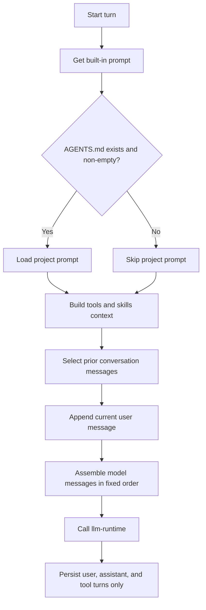

# AP: conversation-prompt-order

- Story slug: `conversation-prompt-order`
- Created: `2026-05-11`
- Status: Implemented
- Related requirement: `./.docs/reqs/2026/05/11/req-conversation-prompt-order.md`

## Goal

Make prompt assembly deterministic so every turn sends the built-in system prompt first, then repository `AGENTS.md` content when present, then the combined tools/skills context, followed by the current user message.

## Assumptions

1. The built-in prompt remains a stable default string defined in `lib/agent-files.js`.
2. `AGENTS.md` content should augment the built-in prompt rather than replace it.
3. The current tools/skills guidance can remain one combined `system` message built from the discovered skill inventory.
4. Persisted chat history should continue to exclude system prompt messages and only store conversation/tool turns.
5. Existing unit coverage around `buildMessages` and prompt loading can be extended in place.

## Proposed Structure

1. Separate prompt-source loading from prompt-message assembly:
   - Keep the built-in prompt available independently of filesystem state.
   - Load `AGENTS.md` as optional project prompt content instead of collapsing it into a fallback string.
2. Build base system messages in explicit order:
   - Built-in system prompt
   - Project `AGENTS.md` content when present and non-empty
   - Combined tools/skills inventory message when available
3. Keep conversation-state handling unchanged:
   - Historical chat messages remain selected by `historyMessageLimit`
   - The pending user message remains the last pre-response conversation message
   - Persisted messages continue to exclude system prompt material
4. Validate ordering at two levels:
   - Agent-file tests verify built-in and project prompt sources are exposed distinctly
   - Runtime-client tests verify the built message order passed into `respondWithTools(...)`

## Implementation Phases

- [x] Phase 1: Split prompt source responsibilities.
  - Add a helper that returns built-in prompt content without depending on `AGENTS.md`.
  - Change project prompt loading so `AGENTS.md` is optional supplemental content.
  - Preserve the current missing-or-empty behavior without throwing.

- [x] Phase 2: Update runtime message assembly.
  - Refactor base system-message construction to emit built-in prompt first.
  - Append `AGENTS.md` content only when present.
  - Append the combined tools/skills context after prompt content.

- [x] Phase 3: Expand verification coverage.
  - Add unit tests for prompt-source loading semantics.
  - Add runtime-client tests that assert exact ordering of built-in prompt, `AGENTS.md`, tools/skills context, and user message.
  - Keep persisted-history assertions to prove no storage behavior regressed.

- [x] Phase 4: Document the runtime contract.
  - Update `README.md` to state that the built-in prompt is always included and `AGENTS.md` is layered on top when present.
  - Clarify that tools/skills guidance is injected after prompt content and before user input.

## Verification Run

Executed on `2026-05-11`:

1. `vitest run tests/unit/agent-files.test.js tests/unit/runtime-client.test.js`
2. `vitest run tests/unit/agent-files.test.js tests/unit/runtime-client.test.js tests/unit/agent-cli.test.js`
3. `npm run test:syntax`

Observed result:
- All targeted unit tests passed.
- The CLI unit suite passed after restoring the existing entrypoint behavior.
- Syntax checks passed.

## Execution Flow

## Test Strategy

1. Unit-test `lib/agent-files.js` for three cases: missing `AGENTS.md`, empty `AGENTS.md`, and non-empty `AGENTS.md`.
2. Unit-test `lib/runtime-client.js` to assert the exact system-message order in `buildMessages(...)`.
3. Add an opt-in live e2e probe-token scenario that places one unique token in the built-in prompt path and one unique token in a test skill, then verifies both appear in the response when live e2e is enabled.
4. Keep live e2e optional behind the existing `AGENT_CLI_ENABLE_LIVE_E2E=1` gate so local deterministic runs remain stable.

## Architecture Review

### Outcome

The plan is sound with one important constraint: do not overload `loadSystemPrompt()` with two responsibilities. Keep built-in prompt content and project `AGENTS.md` content as distinct sources, then compose them in the runtime layer.

### Checks

1. Separating prompt sources avoids ambiguous fallback behavior and makes ordering testable.
2. Keeping tools/skills guidance as one combined message minimizes blast radius because the current runtime already builds one inventory message.
3. Leaving persisted chat handling unchanged preserves transcript compatibility and keeps this story scoped to request construction.

### Tradeoffs

1. Moving composition into the runtime layer adds a small amount of message-assembly code, but it makes the contract explicit instead of hiding it behind string fallback behavior.
2. Always including the built-in prompt may slightly increase token usage, but it guarantees a stable baseline regardless of repository prompt state.
3. Live e2e proof gives higher confidence for prompt delivery, but it should remain opt-in because it depends on external provider availability.

### Risks To Watch During SS

1. Tests that currently assume `loadSystemPrompt()` returns either AGENTS content or the default string will need to be updated to the new split-source model.
2. If transient system instructions are appended after base messages, ordering assertions must distinguish between base-system ordering and transient retry instructions.
3. README wording must not imply that `AGENTS.md` replaces the built-in prompt anymore.