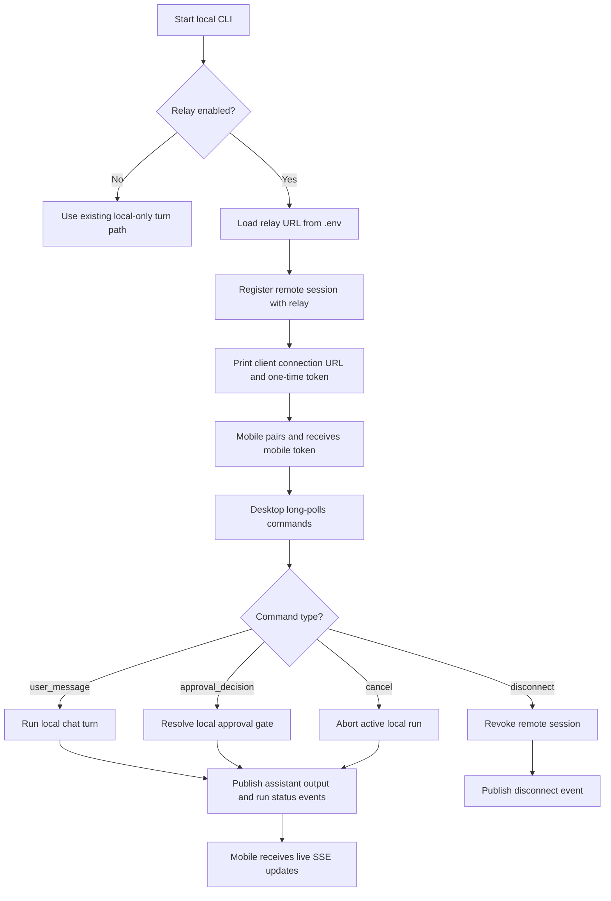

# AP: remote-control-relay

- Story slug: `remote-control-relay`
- Created: `2026-05-11`
- Status: Implemented
- Related requirement: `./.docs/reqs/2026/05/11/req-remote-control-relay.md`
- Related test spec: `./.docs/tests/test-remote-control-relay.md`

## Goal

Add optional relay-backed remote supervision for one active local Agent CLI session while keeping all agent execution, tool execution, workspace access, local files, environment secrets, memory, and permission enforcement on the local machine.

## Assumptions

1. The MVP only needs a relay service contract and a desktop-host integration point inside this repository; the mobile PWA implementation may live elsewhere.
2. The current local CLI behavior must remain the default path when `--remote` is not used.
3. The relay may keep only short-lived coordination state in memory or equivalent short-lived storage; durable relay-side chat persistence is out of scope.
4. Long polling is sufficient for host-side command delivery in the MVP and is preferred over WebSocket for simpler operational behavior and auditability.
5. SSE is sufficient for mobile-side live event delivery in the MVP.
6. Approval decisions must terminate at the local permission boundary, even if they originate from a remote mobile client.
7. A single active locally hosted remote session is enough for the first version; multi-session remote multiplexing is not required.
8. QR-code pairing can be satisfied by defining a canonical one-time client connection URL payload that the desktop host can print and any QR renderer can encode.
9. When `--remote` is present, the CLI enters a long-lived remote-host session for one active chat and reads the relay server URL from `AGENT_CLI_RELAY_SERVER_URL` loaded from `.env` or the environment.
10. If a positional message is also provided with `--remote`, that message is processed as the initial local turn before the host begins waiting for remote commands.
11. Remote payload safety must be enforced by explicit redaction rules rather than by ad hoc string filtering.

## Proposed Structure

1. Add an optional relay service surface:
   - Standalone HTTP server entrypoint for relay deployment or local development.
   - Endpoints for desktop session registration, pairing, command long polling, command submission, event publication, SSE event subscription, notification reads, revoke, and expiry-aware session status.
2. Add a relay data model with strict scope boundaries:
   - Session record keyed by relay session ID and tied to exactly one active local session/chat.
   - Separate desktop token, mobile token, and short-lived pairing token.
   - Short-lived queues for normalized events, normalized commands, and notification-oriented state changes.
   - Idempotency maps scoped by command/event/approval channel.
3. Add desktop-host remote mode to the CLI:
   - New remote-host execution path activated by the presence of `--remote`.
   - Resolve the relay server URL from `AGENT_CLI_RELAY_SERVER_URL` rather than a CLI URL argument.
   - If a positional message is present, treat it as the first locally executed turn and then continue in host mode for subsequent remote commands.
   - Registration handshake that returns session ID, pairing token, and client connection URL.
   - Print the client connection URL so supervising clients can connect immediately.
   - Blocking command poll loop that consumes remote messages, approval decisions, cancel, resume, and disconnect.
   - Event publication for assistant output, run status, approval requests, completion, failure, and disconnect.
4. Add local permission-gate integration:
   - When tool permission mode requires approval, emit a remote approval request event.
   - Wait for a mobile approval decision through the relay command path before continuing local tool execution.
   - Reject or cancel the local tool request if the remote decision denies or the session is revoked/expired.
5. Keep local-first safety explicit:
   - Never serialize workspace files, `.env`, provider API keys, or long-term memory into relay payloads.
   - Restrict relay payloads to normalized text/status/approval metadata needed for the active session only.
   - Use explicit safe-summary builders for tool arguments, failures, and status metadata so remote payloads are allowlisted and redact-by-default.
   - Persist optional local remote-session metadata under the local chat directory only for the active chat.

## API Shape

### Relay Session Lifecycle

1. `POST /v1/sessions`
   - Called by the desktop host.
   - Returns relay session ID, desktop token, short-lived pairing token, client connection URL payload, and expiry timestamps.
2. `POST /v1/sessions/{sessionId}/pair`
   - Called by the mobile client with the one-time pairing token.
   - Returns a mobile-scoped token and session metadata safe for the mobile client.
   - Uses the client connection URL returned during session creation as the canonical QR payload.
3. `POST /v1/sessions/{sessionId}/revoke`
   - Called by desktop or mobile using its scoped token.
   - Marks the session revoked and emits a disconnect terminal state.

### Host Mode Contract

1. `agent-cli --remote`
   - Starts a long-lived remote-host session for the current local chat.
   - Reads the relay server URL from `AGENT_CLI_RELAY_SERVER_URL`.
   - Prints the canonical client connection URL payload for QR-based pairing.
2. `agent-cli --remote <message>`
   - Starts the same long-lived remote-host session.
   - Runs `<message>` as the initial local turn before transitioning into the remote command wait loop.
3. A remote-host session remains scoped to the active local chat selected by the normal current-chat or `--new-chat` behavior.

### Desktop Host Data Flow

1. `POST /v1/sessions/{sessionId}/events`
   - Desktop publishes normalized remote events.
   - Each write includes an idempotency key.
2. `GET /v1/sessions/{sessionId}/commands/poll`
   - Desktop blocks until at least one command is available, timeout is reached, or the session is revoked/expired.
   - Returns commands after the provided cursor.

### Mobile Client Data Flow

1. `GET /v1/sessions/{sessionId}/events`
   - Mobile subscribes with `Accept: text/event-stream` for live SSE updates.
   - May also support cursor-based JSON reads for reconnect/backfill.
2. `POST /v1/sessions/{sessionId}/commands`
   - Mobile submits normalized commands with idempotency keys.
3. `GET /v1/sessions/{sessionId}/notifications`
   - Mobile or notification worker reads approval-required, run-completed, run-failed, and human-input-needed summaries.

## Normalized Payloads

### Event Types

1. `assistant_output`
   - Incremental assistant text chunks or final text snapshots.
2. `run_status`
   - Values such as `remote_session_started`, `waiting_for_input`, `started`, `completed`, `failed`, `cancel_requested`, `cancelled`, `approval_pending`.
3. `tool_approval_request`
   - Approval identifier, tool name, and safe tool argument summary.
   - Must exclude raw workspace paths, raw file contents, environment-variable values, and any argument fields not explicitly allowlisted for remote display.
4. `completion`
   - Final assistant response summary for the completed turn.
5. `failure`
   - Error summary safe for remote display.
   - Must use a redacted summary rather than raw stack traces or provider payload dumps.
6. `disconnect`
   - Terminal remote-session state with revoke/expiry/manual-disconnect reason.

### Command Types

1. `user_message`
   - Mobile-supplied user input routed into the active local session.
2. `approval_decision`
   - Approval identifier, allow/deny decision, and optional reason.
3. `cancel`
   - Request to abort the active local run.
4. `resume`
   - Request to continue after a known host-managed waiting state such as `waiting_for_input`.
   - Does not resume an already aborted or already completed model turn.
5. `disconnect`
   - Request to end the remote supervision session.

## Local Data Model

### Optional Local Remote Metadata

File: `./.chats/<chat-id>/remote.json`

```json
{
  "chatId": "20260511T120000Z-abcd1234",
  "updatedAt": "2026-05-11T12:00:10.000Z",
  "remoteSession": {
    "sessionId": "relay-session-uuid",
      "clientConnectionUrl": "https://relay.example/pair?...",
    "expiresAt": "2026-05-11T12:15:10.000Z"
  }
}
```

The local metadata file is only a convenience pointer for the active local chat. It must not contain provider credentials, local file contents, memory contents, or full remote event/command transcripts.

## Implementation Phases

- [x] Phase 1: Define relay boundaries and wiring.
  - Add shared relay URL normalization and HTTP client helpers.
  - Add relay server module and dedicated entrypoint.
   - Define and document `AGENT_CLI_RELAY_SERVER_URL` for `--remote` relay connectivity.
  - Update package scripts and syntax coverage for the new relay modules.

- [x] Phase 2: Implement relay session state and transport.
  - Add in-memory session creation, pairing, expiry, revoke, SSE fan-out, command queueing, event queueing, notification summaries, and idempotency tracking.
  - Ensure relay session scope is limited to one active local session/chat.
  - Ensure relay payloads exclude local files, `.env`, API tokens, and long-term memory.

- [x] Phase 3: Add desktop-host remote mode.
   - Extend CLI argument parsing so `--remote` activates remote-host behavior for the current run.
   - Load the relay server URL from `AGENT_CLI_RELAY_SERVER_URL` and fail clearly if `--remote` is used without that setting.
   - Register a remote session and print the client connection URL for QR-based pairing.
  - Add blocking long-poll command processing and remote event publication.
  - Persist optional remote-session metadata under the local chat directory.

- [x] Phase 4: Integrate local approvals and cancellation.
  - Thread an abort signal into the existing runtime turn loop.
  - Add a host-side approval gate that emits remote approval requests and waits for approval decisions.
  - Ensure deny, revoke, expiry, and disconnect conditions stop local tool progression safely.
   - Define explicit behavior for `resume` so it only clears host-managed waiting states and is ignored for completed or aborted turns.

- [x] Phase 5: Expand tests and documentation.
  - Add unit coverage for relay session lifecycle, idempotency, expiry, revoke, SSE backlog delivery, and command long polling.
  - Add CLI/host integration tests for remote registration, command consumption, approval routing, cancel, and local-only fallback.
   - Add tests that assert remote approval and failure payloads are redacted and do not expose raw local-sensitive fields.
   - Update `README.md` with `.env` relay setup, `--remote` usage, printed client connection URL behavior, safety boundaries, and MVP transport choices.

## Verification Strategy

1. Unit tests for relay server state transitions:
   - Session creation
   - Pairing success and expired pairing rejection
   - Event deduplication by idempotency key
   - Command deduplication by idempotency key
   - Revoke and expiry terminal behavior
2. Unit tests for remote-host orchestration:
   - Registration output and local metadata persistence
   - Initial-message host-mode behavior when `--remote` and a positional message are both present
   - Long-poll command handling
   - Approval request and approval decision routing
   - Cancel propagation through abort signals
   - Resume behavior for known waiting states only
   - Redaction of tool approval and failure payloads before relay publication
3. CLI unit tests for `--remote` argument parsing, `AGENT_CLI_RELAY_SERVER_URL` loading, and local-only fallback behavior.
4. Human-readable cross-system E2E scenarios captured in `./.docs/tests/test-remote-control-relay.md`.

Implemented and verified on `2026-05-11` with:

1. `npm run test:syntax`
2. `npm run test:unit`

Result: 64 unit tests passed, including relay lifecycle, remote payload redaction, runtime approval gating, and remote host startup persistence.

## Execution Flow



## Architecture Review

### Outcome

The overall design remains sound for the MVP after tightening the operator contract: `--remote` now explicitly means long-lived host mode, relay connection details come from `.env`, `resume` is limited to known host-managed waiting states, and remote payloads must be built from explicit allowlisted summaries instead of raw local objects.

### Checks

1. Keeping the relay stateless beyond short-lived queues and tokens aligns with the local-first safety requirement and reduces data exposure.
2. Long polling for commands and SSE for events fits the requested MVP transport split while keeping reconnection behavior understandable.
3. Scoping the relay session to exactly one local chat avoids accidental workspace-wide remote control and matches the requirement.
4. Routing approval decisions back into the existing local permission gate preserves the fundamental trust boundary.
5. Defining the `--remote` host-mode contract removes ambiguity about whether relay mode is one-shot or long-lived.
6. Redact-by-default payload shaping is necessary to make the local-first safety boundary enforceable in implementation and test.

### Tradeoffs

1. In-memory relay storage is simpler and safer for the MVP, but relay restarts will terminate active remote sessions rather than recover them.
2. Blocking long polling is easier to audit than WebSocket, but it adds some request overhead and slightly higher latency.
3. Publishing only normalized events protects local data, but it means the mobile client cannot reconstruct every detail of the local terminal state.
4. Using `--remote` as the activation input keeps the operator workflow simpler, but it requires explicit `.env` validation and clear startup errors when relay configuration is missing.
5. Constraining `resume` to host-managed waiting states reduces ambiguity, but it means the mobile client cannot revive an already aborted turn.

### Risks To Watch During SS

1. If the CLI reuses the existing one-shot entrypoint without refactoring turn execution into a shared helper, remote-host mode will become brittle and duplicate persistence logic.
2. If approval events include raw tool payloads without filtering, the relay may accidentally leak local-sensitive context.
3. If revoke/expiry only close the relay session but do not abort local waits or runs, the host may continue operating after remote access should have ended.
4. If idempotency is implemented only on the relay write path and not respected by the host coordinator, duplicate approvals or duplicate messages may still create local duplicate effects.
5. If the client connection URL contract is not treated as the canonical QR payload, the desktop and mobile implementations may drift.
6. If remote payload builders are not redact-by-default, approval requests or failures may leak local-sensitive details even when transport and storage are otherwise scoped correctly.