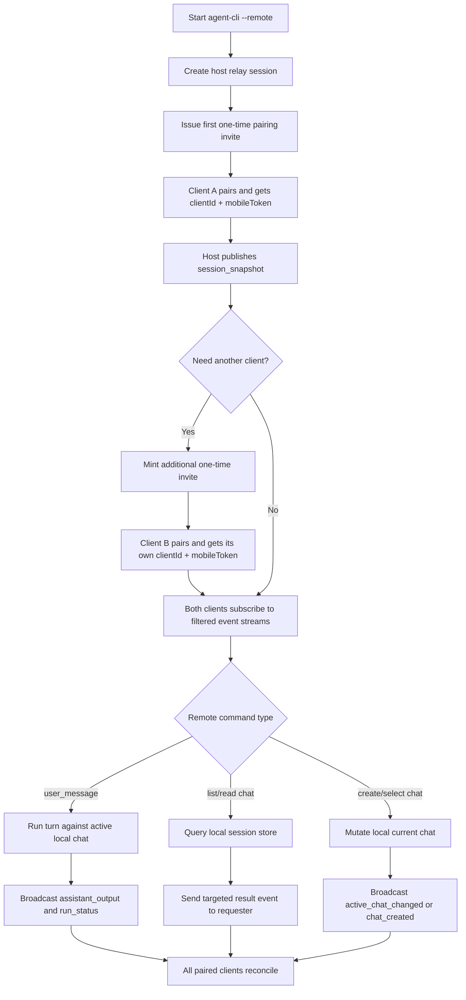

# AP: multi-client-chat-broadcast

- Story slug: `multi-client-chat-broadcast`
- Created: `2026-05-13`
- [x] Implemented
- Related requirement: `./.docs/reqs/2026/05/13/req-multi-client-chat-broadcast.md`
- Related test spec: `./.docs/tests/test-multi-client-chat-broadcast.md`

## Goal

Extend the existing relay-backed remote host so one local `agent-cli --remote` process can serve multiple paired clients at once, while allowing those clients to browse local chats, inspect chat history, create chats, and switch the active chat without moving execution or long-term persistence off the local machine.

## Assumptions

1. The local CLI host remains the only authority for chat persistence, active-chat selection, runtime execution, tool execution, and permission gating.
2. The remote feature still represents one hosted workspace-root session, not multiple independent remote host sessions inside the same process.
3. Existing assistant-output, approval, cancel, resume, and disconnect flows must remain compatible for already-paired single-client consumers.
4. Multi-client support must not weaken the earlier short-lived one-time invite safety model; instead, the relay should support multiple one-time pairing invites per host session rather than one reusable global pairing token.
5. Initial remote chat browsing can return full local message history for one requested chat; pagination can remain a follow-up concern if the payload envelope leaves room for cursors later.
6. Query-style remote operations such as chat list and chat message retrieval should not force unrelated clients to redraw their visible transcript unless the underlying active chat actually changes.
7. The current relay already supports multiple live SSE connections; the main structural gap is authentication, audience filtering, and host-side chat control.

## Proposed Structure

1. Extend relay session state in [server/lib/relay-server.js](server/lib/relay-server.js):
   - Replace the single `mobileToken` field with a per-client registry keyed by `clientId` and containing `mobileToken`, `pairedAt`, optional `mobileName`, and last-seen metadata.
   - Replace the single session-level `pairingToken` with a short-lived invite registry so one session can mint multiple one-time pairing links without making an invite reusable.
   - Keep one shared command queue for host-visible commands and one shared notification queue for session-wide alerts.
   - Add event audience metadata so session-wide events still fan out to all clients, while request/response data can be delivered only to the requesting client.
2. Extend relay HTTP/API contracts in [server/lib/relay-server.js](server/lib/relay-server.js), [lib/relay-client.js](lib/relay-client.js), and [web/src/relay-api.ts](web/src/relay-api.ts):
   - Keep `POST /v1/sessions` and `POST /v1/sessions/{sessionId}/pair` for the first client path.
   - Add a host-scoped or authorized-client-scoped way to mint additional one-time pairing invites for the same session.
   - Preserve `POST /events`, `GET /events`, `POST /commands`, `GET /commands/poll`, `GET /notifications`, and `POST /revoke`.
   - Extend command and event envelopes with `requestId`, `clientId`, and optional `targetClientId` or equivalent audience metadata.
3. Add host-side chat management orchestration in [lib/remote-control.js](lib/remote-control.js):
   - Replace the fixed `params.chat` assumption with a mutable active-chat reference that can be swapped safely between turns.
   - Continue to serialize actual model turns so only one active run executes at a time.
   - Handle new remote command types for chat list, chat message retrieval, chat creation, and chat selection.
   - Emit explicit success and failure events for those commands, with shared broadcasts only for session-wide state changes such as active-chat switches or newly created chats.
4. Expand the local session-store surface in [lib/session-store.js](lib/session-store.js):
   - Add helpers to enumerate persisted chats with metadata suitable for a remote picker.
   - Add helpers to read one chat by ID without mutating the current pointer.
   - Add helpers to create and persist an empty chat and to switch the `current.json` pointer intentionally.
   - Keep the current file layout under `./.chats/<chatId>/` unchanged.
5. Update remote-session metadata handling in [lib/session-store.js](lib/session-store.js) and the host lock flow:
   - Preserve the workspace-root remote-host lock so only one remote host runs at once.
   - Update lock and optional `remote.json` metadata to tolerate active-chat changes during a long-lived remote session.
   - Treat the hosted remote session as workspace-root scoped even though each turn still runs against one selected chat at a time.
6. Extend the web client in [web/src/App.tsx](web/src/App.tsx) and [web/src/relay-session.ts](web/src/relay-session.ts):
   - Keep the existing transcript view for shared assistant output and approvals.
   - Add a chat picker panel, chat-history loading flow, create-chat action, and active-chat indicator.
   - Track the paired client identity so requester-only responses can be matched to the right browser tab.
   - Keep old message/approval UX intact for users who never open the chat-management controls.

## API Shape

### Pairing And Client Identity

1. `POST /v1/sessions`
   - Returns the first one-time pairing invite for the remote host session, as it does today.
   - Also returns the active chat ID and enough session metadata for the host to publish an initial snapshot.
2. `POST /v1/sessions/{sessionId}/pair`
   - Consumes one invite and returns a unique `clientId`, a client-scoped `mobileToken`, expiry data, and the current active chat ID.
   - No longer blocks future clients from pairing with the same session once a new invite exists.
3. `POST /v1/sessions/{sessionId}/pairing-invites`
   - Creates an additional one-time invite for the same host session.
   - Must require an already-authorized session token so unpaired clients cannot mint more invites.

### Command Types

1. Existing commands remain valid:
   - `user_message`
   - `approval_decision`
   - `cancel`
   - `resume`
   - `disconnect`
2. New commands for chat management:
   - `list_chats`
   - `read_chat_messages`
   - `create_chat`
   - `select_chat`
3. Each command payload should carry a `requestId` so the host can emit a matching success or failure response.

### Event Types

1. Shared session-wide broadcast events:
   - `assistant_output`
   - `run_status`
   - `tool_approval_request`
   - `completion`
   - `failure`
   - `disconnect`
   - `active_chat_changed`
   - `chat_created`
   - `session_snapshot`
2. Requester-targeted response events:
   - `chat_list_result`
   - `chat_messages_result`
   - `command_error`
   - Optional `pairing_invite_created` if invite minting is exposed through the same event channel.
3. Event envelopes should carry audience metadata so backlog reads and SSE delivery can filter requester-only events per client while still broadcasting shared session events to every paired client.

## Local Data Model

### Session Store Surface

Add or extend helpers in [lib/session-store.js](lib/session-store.js):

1. `listPersistedChats()`
   - Returns chat IDs plus `createdAt`, `updatedAt`, message count, and whether the chat is currently active.
2. `loadChatById(chatId)`
   - Returns one chat without changing `current.json`.
3. `createPersistedChat()`
   - Creates an empty chat directory and updates `current.json` only when requested by the caller.
4. `setCurrentChat(chatId)`
   - Switches the active pointer explicitly after validation.

### Remote Host State

Inside [lib/remote-control.js](lib/remote-control.js):

1. Maintain `activeChatRef` instead of a fixed `chat` object passed once at startup.
2. Keep a host-side `runState` snapshot containing active chat ID, wait status, active run presence, and outstanding approvals.
3. Publish `session_snapshot` on startup, after each successful pair, after chat creation, and after chat selection so late-joining clients can reconcile quickly.
4. Continue to enforce a single active model turn at a time, even with multiple clients submitting commands.

## Implementation Phases

- [x] Phase 1: Refactor relay session/auth model for multiple clients.
  - Replace single mobile-token storage with a client registry.
  - Add pairing-invite registry and one-time invite issuance for additional clients.
  - Add audience-aware event storage and filtered SSE/backlog delivery.
  - Preserve backward compatibility for the first-client pairing path.

- [x] Phase 2: Expand local chat persistence APIs.
  - Add list, load-by-ID, create, and explicit select helpers in [lib/session-store.js](lib/session-store.js).
  - Keep `messages.json`, `events.json`, `remote.json`, and `current.json` formats compatible where possible.
  - Update remote-host lock metadata if needed so chat switching does not leave stale chat IDs behind.

- [x] Phase 3: Add host-side remote chat control.
  - Refactor [lib/remote-control.js](lib/remote-control.js) to use a mutable active chat reference.
  - Route new chat-management commands through the local session store.
  - Emit requester-targeted result events and shared active-chat broadcasts.
  - Ensure user messages run against the selected chat and remain serialized with approvals and cancellation.

- [x] Phase 4: Update browser relay client and UI.
  - Extend [web/src/relay-api.ts](web/src/relay-api.ts) for new pairing-invite and chat-management contracts.
  - Update [web/src/App.tsx](web/src/App.tsx) to render multiple-session metadata, chat picker controls, and targeted responses.
  - Keep existing transcript, approval, and disconnect flows stable.

- [x] Phase 5: Verify compatibility, tests, and docs.
  - Add relay-server unit coverage for multi-client pairing, audience filtering, and invite issuance.
  - Add host/session-store tests for list/load/create/select flows and active-chat switching.
  - Add browser API tests or type-safe contract checks where practical.
  - Update [README.md](README.md) with multi-client behavior, invite lifecycle, and remote chat-management capabilities.

## Verification Strategy

1. Unit tests in [tests/unit/relay-server.test.js](tests/unit/relay-server.test.js):
   - Multiple clients can pair against the same host session through separate one-time invites.
   - Shared events reach every client.
   - Targeted events are visible only to the intended client in both backlog reads and live SSE delivery.
   - Invalid or expired invite/token flows are rejected.
2. Unit tests in [tests/unit/session-store.test.js](tests/unit/session-store.test.js):
   - Chat enumeration returns stable metadata.
   - Loading one chat by ID does not mutate the current pointer.
   - Creating and selecting chats updates local persistence correctly.
3. Unit tests in [tests/unit/remote-control.test.js](tests/unit/remote-control.test.js):
   - New chat-management commands are routed to the session store.
   - `user_message` uses the currently selected chat.
   - Active-chat changes broadcast correctly and do not interrupt unrelated waiting states.
   - Approval, cancel, resume, and disconnect behavior still works with multiple clients connected.
4. CLI integration coverage in [tests/unit/agent-cli.test.js](tests/unit/agent-cli.test.js) and [tests/e2e/relay-server.e2e.test.js](tests/e2e/relay-server.e2e.test.js) when appropriate:
   - Existing single-client remote startup remains valid.
   - Multi-client host sessions do not break local-only mode.
5. Human-readable cross-system scenarios are captured in [./.docs/tests/test-multi-client-chat-broadcast.md](./.docs/tests/test-multi-client-chat-broadcast.md).

Implemented and verified on `2026-05-13` with:

1. `npm test`

Result: syntax checks passed, 88 unit tests passed, and the web TypeScript typecheck passed.

## Execution Flow

## Architecture Review

### Outcome

The design is viable if the implementation treats “multi-client” as a relay-session authentication and event-routing problem, not as multiple independent host runtimes. The main architectural correction is preserving one-time invite semantics while adding a client registry and additional invite issuance; making the original pairing token reusable would solve the feature quickly but would weaken an existing safety property.

### Checks

1. Keeping the local CLI as the source of truth for chat storage and active-chat changes preserves the local-first trust boundary.
2. A per-client registry plus filtered events maps cleanly onto the current SSE model and avoids noisy cross-client query responses.
3. A mutable host-side active chat reference is necessary because the current remote-control loop captures one chat ID at session start.
4. Extending the session store is lower risk than creating a second remote-specific persistence layer.
5. Backward compatibility is feasible because existing command types and shared event types can remain unchanged while new envelopes add optional routing metadata.

### Tradeoffs

1. Adding targeted event visibility increases relay complexity, but it avoids broadcasting large chat-history payloads to every connected browser tab.
2. Separate one-time invites per client preserve safety, but they require a small invitation-management surface that does not exist today.
3. Treating chat history reads as direct host queries keeps persistence local, but it means large chat payloads may be slower than a relay-cached model.
4. Keeping only one active model turn simplifies correctness, but clients may need clear UI feedback when another client already triggered a turn.

### Risks To Watch During SS

1. If event audience filtering is implemented only for live SSE and not for backlog reads, reconnecting clients will leak requester-only results.
2. If active-chat switching mutates state during an in-flight model turn, later assistant output may be written to the wrong persisted chat.
3. If remote-host lock metadata stays tied to the original chat ID only, operator diagnostics will become misleading after a remote chat switch.
4. If the browser UI conflates shared state with requester-only responses, multi-client synchronization bugs will look like relay transport bugs.
