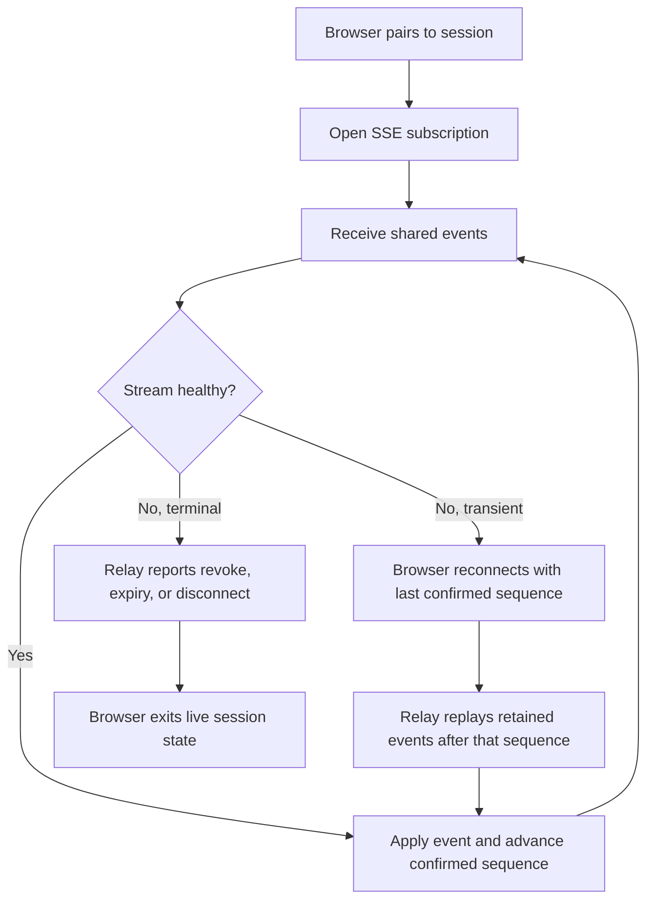

# AP: relay-sse-shared-events

- Story slug: `relay-sse-shared-events`
- Created: `2026-05-13`
- [x] Implemented
- Related requirement: `./.docs/reqs/2026/05/13/req-relay-sse-shared-events.md`
- Related test spec: `./.docs/tests/test-relay-sse-shared-events.md`

## Goal

Clarify and harden the remote relay's browser-facing SSE contract so multiple paired browsers can observe the same shared session, assistant messages are represented as event types, and transient SSE disconnects recover cleanly without restarting the local host.

## Assumptions

1. The existing relay model of browser-to-host commands over HTTPS plus host-to-browser observation over SSE remains the intended shape for this story.
2. One hosted remote session still represents one shared local host session with serialized turns, not multiple independent execution lanes.
3. The current relay already supports multiple concurrent SSE subscribers, so this story is primarily about event semantics, reconnect behavior, and timeout resilience.
4. Shared run-state events such as assistant output and completion should continue to fan out to all authorized paired browsers, while request-result payloads may remain requester-targeted.
5. Resume behavior only needs to cover transient disconnects within the relay's retained event window; reconnect after very long offline gaps may still require snapshot-based recovery.
6. Notification polling may remain temporarily during rollout if removing it would complicate the change, but shared transcript delivery must not depend on polling.
7. The browser UI may treat per-client attribution as presentation metadata rather than as an authorization boundary for this story.

## Proposed Structure

1. Define the browser-facing relay contract around one shared event stream in [server/lib/relay-server.js](server/lib/relay-server.js), [web/src/relay-api.ts](web/src/relay-api.ts), and [web/src/App.tsx](web/src/App.tsx):
   - Keep one SSE subscription per paired browser for shared remote-session observation.
   - Treat assistant output chunks, final assistant responses, run-state changes, approvals, and session snapshots as event types on that stream.
   - Preserve requester-targeted response events for query-style results that should not be broadcast.
2. Tighten event envelope semantics in [lib/remote-control.js](lib/remote-control.js) and [server/lib/relay-server.js](server/lib/relay-server.js):
   - Make shared versus targeted event behavior explicit in the payload contract.
   - Carry enough metadata for the browser to distinguish source client, request correlation, and durable event ordering.
   - Keep session-wide events untargeted unless the event is explicitly a requester-only response.
3. Improve SSE liveness handling in [server/lib/relay-server.js](server/lib/relay-server.js):
   - Send periodic heartbeat comments so idle sessions do not look dead to browsers or intermediaries.
   - Return an SSE retry hint suitable for automatic reconnect.
   - Keep existing event IDs authoritative for resume position.
4. Improve SSE reconnect handling in [server/lib/relay-server.js](server/lib/relay-server.js) and [web/src/App.tsx](web/src/App.tsx):
   - Accept resume position from the browser on reconnect using the standard SSE last-event position when available, with existing cursor query behavior as a compatibility fallback.
   - Support native EventSource reconnect behavior so a transient disconnect does not depend on a manual reconnect button.
   - Restore the live session automatically on browser refresh, connection-link reopen, and foreground resume when the persisted session is still valid.
   - Replay retained events after the last confirmed event so reconnecting browsers can catch up.
   - Distinguish terminal session closure from transient stream loss in both API responses and UI state.
5. Harden browser-side event application in [web/src/App.tsx](web/src/App.tsx):
   - Deduplicate replayed events by sequence during reconnect.
   - Rebuild derived UI state from replay-safe event application instead of assuming each delivery is unique.
   - Re-hydrate persisted relay session state safely on page load or browser resume before deciding the session is disconnected.
   - Keep the UI connected when the stream is temporarily interrupted and only surface terminal failure when the relay reports revoke, expiry, or invalid credentials.
6. Verify the contract with focused tests:
   - Relay unit coverage for shared fan-out, targeted filtering, heartbeat-safe idle periods, and reconnect cursor handling.
   - Browser/client coverage for dedupe and reconnection behavior where practical.
   - End-to-end scenarios for two browsers receiving the same shared events and one browser reconnecting after interruption.

## Transport And Event Model

### Shared Event Types

The following event types remain session-wide and must be visible to every authorized paired browser:

1. `assistant_output`
2. `completion`
3. `run_status`
4. `tool_approval_request`
5. `failure`
6. `disconnect`
7. `session_snapshot`
8. `active_chat_changed`
9. `chat_created`

### Targeted Event Types

The following event types may remain requester-scoped and must not be broadcast unless future requirements change their audience:

1. `chat_list_result`
2. `chat_messages_result`
3. `command_error`

### Resume Contract

1. The server remains the source of truth for monotonically increasing event sequence.
2. The browser tracks the highest confirmed event sequence it has applied.
3. On reconnect, the browser asks for events after that confirmed sequence.
4. If the retained event backlog no longer covers the requested resume point, the browser falls back to current snapshot plus fresh backlog rather than assuming the local UI is still complete.

## Relevant Files

1. [server/lib/relay-server.js](server/lib/relay-server.js)
2. [lib/remote-control.js](lib/remote-control.js)
3. [lib/relay-client.js](lib/relay-client.js)
4. [web/src/relay-api.ts](web/src/relay-api.ts)
5. [web/src/App.tsx](web/src/App.tsx)
6. [tests/unit/relay-server.test.js](tests/unit/relay-server.test.js)
7. [tests/unit/remote-control.test.js](tests/unit/remote-control.test.js)
8. [tests/e2e/relay-server.e2e.test.js](tests/e2e/relay-server.e2e.test.js)

## Implementation Phases

- [x] Inspect relevant files
  - Confirm the current shared-versus-targeted event split in [lib/remote-control.js](lib/remote-control.js) and [server/lib/relay-server.js](server/lib/relay-server.js).
  - Confirm how the browser currently subscribes, reports errors, and tracks event cursor in [web/src/App.tsx](web/src/App.tsx).
  - Confirm current relay tests that already cover fan-out and targeted delivery.

- [x] Make focused changes
  - Add explicit SSE heartbeat and reconnect hints in [server/lib/relay-server.js](server/lib/relay-server.js).
  - Add resume-from-last-event handling on reconnect while preserving current query-based compatibility.
   - Ensure shared event types remain untargeted and requester-only response events remain targeted.
   - Add browser-side dedupe and transient reconnect handling in [web/src/App.tsx](web/src/App.tsx) without surfacing transient reconnect as a terminal connection failure.
   - Restore saved session state automatically on refresh, link reopen, and browser foreground resume when the relay session is still valid.
  - Keep browser-to-host commands on the existing POST path rather than introducing WebSockets.

- [x] Run validation
  - Add or update unit coverage for heartbeat-safe idle streams, reconnect resume, and shared versus targeted event delivery.
  - Add or update relay end-to-end coverage for two-browser shared observation and reconnect-after-interruption behavior.
  - Run the scoped test suite for relay server, remote control, and browser-facing relay logic.

- [x] Update docs/status
   - Left [README.md](README.md) unchanged because the user-visible relay workflow is still accurately described at a high level and this change mainly hardens reconnect behavior.
   - Updated this plan as tasks completed.
   - Retained backlog-window and notification-polling limitations are still documented below as follow-up considerations.

## Verification Strategy

1. Unit tests in [tests/unit/relay-server.test.js](tests/unit/relay-server.test.js):
   - Two paired clients receive the same shared session events.
   - Targeted events remain visible only to the intended client in backlog and live SSE paths.
   - Idle SSE streams stay open long enough to deliver later events.
   - Reconnect requests resume from the correct event position.
2. Unit tests in [tests/unit/remote-control.test.js](tests/unit/remote-control.test.js):
   - Shared run events stay untargeted.
   - Request-response events stay targeted.
   - Source metadata and request correlation remain stable when multiple clients are active.
3. End-to-end coverage in [tests/e2e/relay-server.e2e.test.js](tests/e2e/relay-server.e2e.test.js):
   - Two browsers paired to one session both observe a single remote turn.
   - One browser reconnects after interruption and receives missed retained events without forcing host restart.
4. Browser behavior checks in [web/src/App.tsx](web/src/App.tsx) or associated client tests where practical:
   - Replayed events do not duplicate durable UI state.
   - Native EventSource retry continues automatically while the session remains valid.
   - Refresh, URL reopen, and foreground resume restore the live session automatically when the session is still valid.
   - Transient stream interruption is surfaced differently from terminal session closure.

## Verification Result

Executed on `2026-05-13`:

1. `vitest run tests/unit/relay-server.test.js tests/unit/relay-session.test.js tests/e2e/relay-server.e2e.test.js`
2. `npm --prefix ./web run typecheck`
3. `npm test`

Observed result:

1. Focused relay validation passed.
2. Web TypeScript typecheck passed.
3. Full repository test suite passed.

## Execution Flow

## Architecture Review

### Outcome

The plan is sound for this follow-on story. The main constraint is keeping the work scoped to SSE contract hardening rather than turning it into a transport rewrite or a second multi-client redesign.

### Checks

1. Keeping one shared SSE stream per browser matches the current architecture and the requirement that message-like output is just another event class.
2. Treating reconnect as resume-from-sequence is simpler and safer than adding a second polling channel for transcript recovery.
3. Heartbeats are the smallest practical fix for idle timeout across browsers, proxies, and local network intermediaries.
4. Browser-side dedupe is necessary because reconnect replay is correct behavior, and the UI must tolerate repeated delivery safely.
5. Leaving commands on POST avoids unnecessary WebSocket complexity for a control path that is already explicit and low frequency.
6. Native EventSource reconnect should remain the first-line recovery path; manual reconnect remains a fallback, not the primary design.

### Tradeoffs

1. Adding heartbeats slightly increases relay traffic, but the cost is small relative to the reliability gain.
2. Supporting both standard last-event resume and existing query-based cursor compatibility adds some server complexity, but it lowers migration risk.
3. Keeping notification polling temporarily may leave some duplication in client logic, but it avoids over-scoping this story if transcript reliability is the primary requirement.
4. Preserving native EventSource retry semantics may require softening current UI error handling so transport noise does not look like a terminal session failure.
5. Auto-restoring from saved session state improves continuity, but it requires careful validity checks so expired or revoked sessions do not look healthy.

### Risks To Watch During SS

1. If reconnect resume uses only one code path while another path still relies on `after`, browsers may resume inconsistently.
2. If replayed `session_snapshot` or `active_chat_changed` events are applied without dedupe discipline, the UI may flicker or duplicate derived state.
3. If heartbeat timers are not cleaned up when SSE clients disconnect, the relay can leak timers and socket references.
4. If terminal session errors and transient transport errors are collapsed into one UI state, the reconnect experience will still feel broken even if the transport resumes correctly.
5. If the server ignores `Last-Event-ID` during native EventSource reconnect and only honors the original `after` query, reconnect can replay stale events indefinitely.
6. If refresh or foreground-resume logic restores stale local session state before revalidation, the browser can briefly show an invalid connected state.