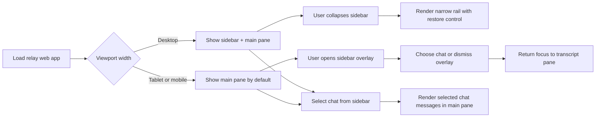

# AP: responsive-chat-shell

- Story slug: `responsive-chat-shell`
- Created: `2026-05-13`
- [x] Implemented
- Related requirement: `./.docs/reqs/2026/05/13/req-responsive-chat-shell.md`
- Related test spec: `./.docs/tests/test-responsive-chat-shell.md`

## Goal

Restructure the relay web UI into a responsive split chat workspace with a left chat list and a main conversation pane, while preserving existing relay session behavior, active-chat state handling, approval flows, and message sending.

Use the user-provided ChatGPT screenshot from `2026-05-13` as the primary implementation reference for shell layout, spacing rhythm, conversation emphasis, and sidebar behavior.

## Extracted Design System

Use the attached reference to drive the implementation with the following concrete design-system decisions:

1. Layout
   - Left navigation column that stays structurally separate from the conversation pane.
   - Main pane centered around a readable content column rather than a full-width transcript.
   - Minimal top utility row.
   - Bottom composer anchored as a persistent shell element.
2. Color and surfaces
   - Neutral gray or off-white page foundation.
   - Slightly differentiated sidebar surface.
   - Low-contrast borders and dividers.
   - Rounded inputs and message surfaces.
3. Typography
   - Clean sans-serif throughout.
   - Small, scan-friendly navigation labels.
   - Comfortable transcript typography with restrained weight changes.
4. Controls
   - Quiet ghost or secondary buttons for shell actions.
   - Minimal iconography.
   - Soft hover states and restrained shadows.
5. Message treatment
   - User messages rendered as compact, visually distinct pills or bubbles.
   - Assistant output given more width, whitespace, and reading emphasis.
6. Responsive model
   - Persistent desktop sidebar.
   - Mobile overlay or drawer behavior.
   - Composer and conversation content remain primary at small widths.

## Assumptions

1. The current relay web app already has the data needed to render a chat list, active chat, transcript, and session actions without requiring relay API changes.
2. The main implementation surface is limited to [web/src/App.tsx](web/src/App.tsx) and [web/src/styles.css](web/src/styles.css), with only minor adjustments elsewhere if TypeScript support code needs small shape changes.
3. The redesign should reuse the existing chat list data, active-chat state, and transcript event flow rather than introducing duplicate UI state or a second client-side model.
4. On desktop-width layouts, collapsing the sidebar should reduce it to a narrow rail that still exposes a restore control.
5. On mobile-width layouts, the sidebar should behave as a hidden or overlay panel that opens on demand, closes after chat selection, and does not permanently consume the viewport.
6. Existing pairing, reconnect, approval, streaming, and composer flows must remain functional after the layout change.
7. The implementation should take direct cues from the attached ChatGPT reference for the macro layout: slim left navigation, spacious central transcript column, understated top bar controls, and a composer anchored near the bottom of the conversation pane.
8. The implementation should interpret the reference rather than duplicate it literally, preserving project identity and avoiding exact branded reproduction.
9. The extracted design system above is specific enough that SS should not need to invent a separate visual direction.

## Proposed Structure

1. Refactor [web/src/App.tsx](web/src/App.tsx) into a shell-based layout:
   - Introduce explicit UI state for desktop sidebar collapse and mobile sidebar visibility.
   - Keep chat summaries and active-chat state in the sidebar region.
   - Keep transcript, approvals, notifications, and composer in the main conversation region.
   - Move existing session actions into stable header areas that remain reachable across breakpoints.
2. Rework [web/src/styles.css](web/src/styles.css) around a two-panel workspace:
   - Add layout primitives for app frame, sidebar, sidebar rail, main conversation pane, and mobile backdrop.
   - Use responsive breakpoints so desktop shows the split layout while mobile prioritizes the conversation pane.
   - Preserve readable transcript width, composer spacing, and approval card fit across viewport sizes.
   - Mirror the reference's overall composition by keeping the sidebar visually lighter and the transcript area more open and centered.
   - Introduce explicit CSS tokens for neutral surfaces, divider contrast, radius scale, spacing scale, and shell sizing so the extracted design system is applied consistently.
   - Favor quiet controls and subtle states over strong filled buttons in shell chrome.
3. Keep interaction behavior aligned with existing data flow:
   - Chat selection continues to use the existing active-chat mechanism.
   - Existing chat-creation and session controls stay visible in the shell rather than moving into hidden secondary areas.
   - The mobile sidebar closes automatically after selecting a chat to return focus to the transcript.
4. Limit scope to visual structure and responsive interaction:
   - Do not change relay protocol behavior.
   - Do not alter chat semantics, persistence, or markdown rendering beyond layout-driven adjustments.

## Responsive Interaction Model

1. Desktop
   - Show sidebar and main pane side by side.
   - Allow the user to collapse the sidebar into a narrow rail.
   - Keep the collapse or expand control visible at all times.
   - Keep the transcript content centered within the main pane instead of stretching to the full available width.
2. Tablet and mobile
   - Default to the main conversation pane.
   - Open the chat list as an overlay or slide-in panel.
   - Close the overlay after selecting a chat or dismissing the backdrop.
   - Keep primary session actions reachable without requiring the sidebar to remain open.
   - Preserve a stable bottom composer and readable transcript spacing while the sidebar is hidden.

## Implementation Tasks

- [x] Inspect relevant files
- [x] Make focused changes
- [x] Run validation
- [x] Update docs/status

## Phased Execution

- [x] Phase 1: Inspect current render and identify the existing chat-list, transcript, header, and composer sections in [web/src/App.tsx](web/src/App.tsx).
- [x] Phase 2: Map the attached ChatGPT reference into local shell regions, then introduce shell-level state and restructure markup so the sidebar and main pane are first-class regions without changing data ownership.
- [x] Phase 3: Rebuild the stylesheet in [web/src/styles.css](web/src/styles.css) around a responsive split layout, including desktop collapse and mobile overlay behavior, using the extracted design system for proportions, spacing, surface contrast, message styling, and composer placement.
- [x] Phase 4: Verify active chat switching, streaming transcript rendering, approvals, and composer behavior still fit the new layout through static validation and build checks.
- [x] Phase 5: Update docs and completion status after implementation and verification.

## Styling Guidance For SS

1. Add or revise top-level CSS variables for:
   - background foundation
   - sidebar surface
   - main pane surface
   - divider and border contrast
   - primary text and muted text
   - radius scale
   - shell spacing scale
2. Use layout classes that separate:
   - app frame
   - sidebar
   - collapsed sidebar rail
   - main pane
   - transcript column
   - composer dock
   - mobile overlay and backdrop
3. Keep component-level styles aligned to the extracted system:
   - chat list rows should be compact and scan-friendly
   - utility actions should remain understated
   - user messages should have a compact bubble treatment
   - assistant messages should maximize readability rather than look card-heavy

## Verification Strategy

1. Run `npm --prefix ./web run typecheck` to confirm the React and TypeScript changes remain valid.
2. Run any existing repo-level verification that becomes relevant if implementation touches shared code outside the web app.
3. Execute the human-readable responsive UI scenarios in [./.docs/tests/test-responsive-chat-shell.md](./.docs/tests/test-responsive-chat-shell.md).
4. Confirm desktop, tablet, and mobile behavior manually in the browser using viewport resizing or device emulation.
5. Compare the implemented shell against the attached ChatGPT reference at a high level to confirm the intended layout cues were carried over.

## Verification Result

Executed on `2026-05-13`:

1. `npm --prefix ./web run typecheck`
2. `npm --prefix ./web run build`

Observed result:

1. Web TypeScript typecheck passed.
2. Vite production build passed.
3. Manual browser viewport exercise against the human-readable scenarios has not been run in this session.

## Execution Flow

## Architecture Review

### Outcome

The design is sound if the implementation treats this as a layout and interaction-shell change rather than a data-model rewrite. The highest-leverage decision is keeping all current chat and relay behavior intact while introducing only the minimum UI state needed for sidebar collapse and mobile visibility.

### Checks

1. The requirement does not force relay or persistence changes, so the implementation can stay local to the web client.
2. A desktop collapsed rail plus mobile overlay satisfies the responsive requirement without maintaining separate layouts for different platforms.
3. Preserving the existing chat list source and active-chat state avoids desynchronization between navigation UI and transcript rendering.
4. Keeping session actions in a stable header area reduces the risk that the responsive shell hides critical controls.
5. A stylesheet-led layout change is lower risk than breaking the app into new components unless the current markup proves too coupled during SS.
6. Using the attached ChatGPT screenshot as a composition reference narrows design ambiguity and gives implementation a concrete target without forcing literal cloning.
7. Extracting an explicit design system from the reference further reduces implementation drift and should keep layout and styling decisions coherent across markup and CSS.

### Tradeoffs

1. A closer ChatGPT-like shell improves familiarity, but the app should stop short of copying proprietary branding or exact interaction details.
2. A mobile overlay sidebar preserves conversation space, but it adds a small amount of UI state and dismissal logic.
3. A desktop collapsed rail keeps chat navigation discoverable, but it constrains how much metadata can remain visible when collapsed.
4. Leaving the transcript and composer logic in the same component reduces refactor risk, but the JSX may remain dense unless only the obvious layout regions are extracted.

### Risks To Watch During SS

1. If the sidebar visibility rules mix viewport-derived state with persistent user preference carelessly, the desktop and mobile behaviors may fight each other.
2. If existing session actions are pushed into overflow areas without responsive testing, critical controls may become unreachable on narrow screens.
3. If the transcript pane height calculation changes accidentally, streaming messages or approval cards may scroll poorly or push the composer off screen.
4. If the visual overhaul touches too many unrelated style rules at once, regressions in pairing and empty-state screens will become harder to diagnose.