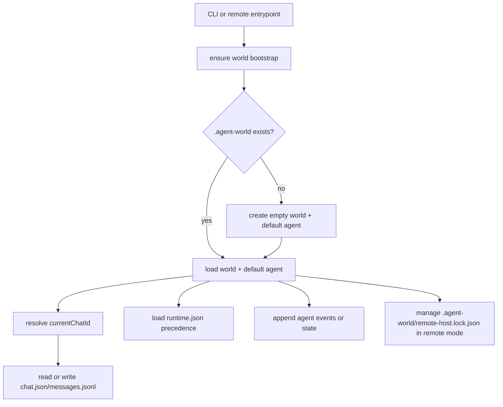

# AP: agent-world-storage

- Story slug: `agent-world-storage`
- Created: `2026-05-14`
- [x] Implemented
- Related requirement: `./.docs/reqs/2026/05/14/req-agent-world-storage.md`
- Related test spec: `./.docs/tests/test-agent-world-storage.md`

## Goal

Move all supported local persistence and remote-host coordination into a world-centric `.agent-world` layout, while keeping remote-mode features working and introducing runtime defaults from repo-root and agent-level `runtime.json` files with the required precedence.

## Assumptions

1. The existing exported session-store API should remain stable where possible so CLI and remote-control call sites need only storage-internal changes rather than a full orchestration rewrite.
2. `.agent-world` is the only supported local storage contract for this story; legacy `.chats` content does not need migration.
3. The default agent is sufficient for the current CLI surface; explicit non-default agent selection can remain out of scope as long as `world.json.defaultAgentId` drives runtime overrides and agent-scoped persistence.
4. Prompt loading from `AGENTS.md` and skill loading from `./.agents/skills/` must remain outside `.agent-world`.
5. Remote host locking is process-coordination state rather than durable chat history, but it should still live under `.agent-world` so the storage model is self-contained.

## Key Design Decisions

1. Keep the public session-store operations stable and change the backing format internally.
2. Introduce a world bootstrap layer that ensures these durable records exist before reads and writes:
   - `./.agent-world/world.json`
   - `./.agent-world/agents/{defaultAgentId}/agent.json`
   - `./.agent-world/agents/{defaultAgentId}/state.json`
   - `./.agent-world/agents/{defaultAgentId}/inbox.jsonl`
   - `./.agent-world/agents/{defaultAgentId}/events.jsonl`
   - `./.agent-world/agents/{defaultAgentId}/memory.md`
3. Store chat metadata in `chat.json` and store normalized persisted messages as one JSON object per line in `messages.jsonl`.
4. Use `summary.md` as a required placeholder file from the first write, even if its initial contents are empty.
5. Treat chat stream traces and remote-session persistence as agent-scoped durability rather than chat-local files:
   - stream trace events append into `agents/{agentId}/events.jsonl` with `chatId` and turn metadata
   - remote-session durable state lives in `agents/{agentId}/state.json`
6. Load runtime defaults through one shared precedence path:
   - repo-root `./runtime.json`
   - optional `./.agent-world/agents/{defaultAgentId}/runtime.json`
   - CLI flags
7. Restrict `.env` and process-environment usage to provider credentials and relay configuration rather than general runtime defaults.
8. Ignore legacy `.chats` data entirely and bootstrap a fresh `.agent-world` contract.

## Proposed Structure

```text
.agent-world/
  world.json
  chats/
    {chatId}/
      chat.json
      messages.jsonl
      summary.md
  agents/
    {agentId}/
      agent.json
      inbox.jsonl
      state.json
      events.jsonl
      memory.md
      runtime.json   # optional
runtime.json        # optional
```

## Data Shape Outline

1. `world.json`
   - `id`
   - `name`
   - `defaultAgentId`
   - `currentChatId`
   - `createdAt`
   - `updatedAt`
2. `chat.json`
   - `id`
   - `agentId`
   - `createdAt`
   - `updatedAt`
   - `messageCount`
3. `agent.json`
   - `id`
   - `name`
   - `provider`
   - `model`
   - `createdAt`
   - `updatedAt`
4. `state.json`
   - current agent-scoped mutable state such as remote-session metadata
5. JSONL records
   - one normalized object per line
   - include `createdAt`
   - include `chatId` on agent events so one agent can retain cross-chat traces

## Bootstrap Flow



## File-Level Plan

1. Refactor [core/paths.js](core/paths.js)
   - add `.agent-world` path helpers for world, chats, agents, and optional agent runtime files
   - move the remote-host lock into `.agent-world`
   - keep current prompt and skill paths unchanged
2. Refactor [core/session-store.js](core/session-store.js)
   - add bootstrap helpers for world and default-agent records
   - keep `world.json.currentChatId` as the only current-chat source of truth
   - store chats in `chat.json` plus `messages.jsonl`
   - move stream trace persistence to agent events and remote-session persistence to agent state
   - keep remote-host locking under `.agent-world/remote-host.lock.json`
   - do not import legacy `.chats` content
3. Refactor [core/agent-config.js](core/agent-config.js)
   - centralize runtime-file loading and precedence
   - validate `schemaVersion`
   - keep provider credential env handling intact while removing non-credential runtime env defaults from the desired architecture
4. Update [bin/agent-cli.js](bin/agent-cli.js)
   - continue using the same high-level flow, but depend on the new storage bootstrap and runtime precedence
   - preserve current missing-message and help-path behavior
5. Update remote and relay call sites only where persistence details leak
   - [core/remote-control.js](core/remote-control.js)
   - sync agent `state.json.currentChatId` after remote `/new` and `/use`
   - tests that assert on `.agent-world` file paths
6. Update docs and examples
   - README storage layout and runtime precedence
   - repo-root `runtime.json` example

## Implementation Tasks

- [ ] Inspect relevant files
- [ ] Make focused changes
- [ ] Run validation
- [ ] Update docs/status

## Verification Strategy

1. Unit tests in [tests/unit/session-store.test.js](tests/unit/session-store.test.js)
   - world bootstrap creates required files
   - chat persistence writes `chat.json`, `messages.jsonl`, and `summary.md`
   - current chat selection uses `world.json.currentChatId`
   - stream traces append to agent events
   - remote-session metadata persists in agent state
   - legacy `.chats` data is ignored by the new storage contract
2. Unit tests in [tests/unit/agent-config.test.js](tests/unit/agent-config.test.js)
   - repo-root `runtime.json` loads correctly
   - default-agent runtime override wins over repo-root runtime values
   - CLI overrides still outrank runtime files
   - provider credentials still come from `.env` or the process environment without requiring runtime-file duplication
3. Unit tests in [tests/unit/agent-cli.test.js](tests/unit/agent-cli.test.js)
   - end-to-end config precedence remains stable
   - non-stream behavior still wins when runtime or CLI disables streaming
   - remote startup and current chat handling continue to work against the new store
4. Remote-host e2e in [tests/e2e/agent-cli-remote.e2e.test.js](tests/e2e/agent-cli-remote.e2e.test.js)
   - remote chat list, load, create, and select continue to work against `.agent-world`
   - host restart or reconnect still surfaces the correct active chat from `world.json`
   - agent `state.json.currentChatId` follows remote chat selection
5. Relay e2e in [tests/e2e/relay-server.e2e.test.js](tests/e2e/relay-server.e2e.test.js)
   - relay behavior remains transport-oriented while the host reads from the new local persistence layer

## Risks

1. The current chat-local `events.json` and `remote.json` files do not map one-to-one onto the requested chat structure, so forcing them into chat directories would violate the new contract; the plan avoids that by moving them to agent scope.
2. If JSONL serialization normalizes messages differently from the current JSON array store, remote reads and replay logic may drift subtly even when tests pass on short histories.
3. If bootstrap always rewrites world or agent files, modification times and current chat state will become noisy and race-prone; writes must remain minimal and deterministic.
4. The new runtime precedence can easily regress startup behavior if config files are loaded too early on help or missing-message paths.
5. If legacy `LLM_*` runtime env keys continue to behave as overrides, the implementation will violate the desired contract that `.env` is only for credentials.
