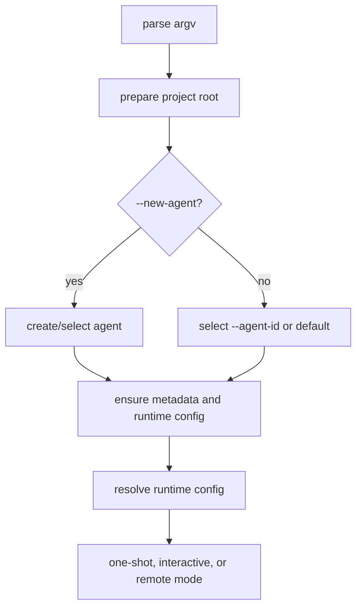

# Plan: Agent ID Config

## Scope

Add agent selection and creation to the CLI while keeping the existing `.agent-world/agents/{agentId}` storage contract.

## Tasks

- [x] Inspect relevant files
- [x] Make focused changes
- [x] Run validation
- [x] Update docs/status

## Design

The CLI should parse `--agent-id` and `--new-agent`, resolve the project root, then ensure/select the requested agent before runtime config is resolved. Session-store functions need an active agent context so chat persistence and trace/state files write to the selected agent, not always `world.defaultAgentId`.

## Implementation Notes

- Extend `ParsedArguments` with `agentId` and `newAgentId`.
- Default agent id is `default`.
- Add session-store APIs for `ensureAgentSelection` and agent metadata/runtime file creation.
- Preserve existing path helpers, including `.agent-world/agents/{agentId}`.
- Load runtime config from root `runtime.json`, agent `agent.json` provider/model, and agent `runtime.json`.
- Make `runtime.json` override `agent.json`, and make CLI flags override runtime files.
- Prompt only when a prompt abstraction is available. For one-shot `runCli`, create a readline prompt only if missing metadata cannot be satisfied by flags.
- Reuse the existing interactive prompt abstraction for tests.
- Keep provider credentials in `.env`/environment only.

## E2E Coverage

Create `.docs/tests/test-agent-id-config.md` because this changes user-visible CLI flags and persistent project state.

## Validation

- Run `npm run test:syntax`.
- Run targeted unit tests for agent config, session store, and CLI parsing/selection.
- Run `npm run test:unit`.
- Manually smoke test `--new-agent` and `--agent-id` against a temporary project where feasible.

## Result

- Added `--agent-id` and `--new-agent` parsing and usage docs.
- Selected agent defaults to `default` when no agent flag is supplied.
- New or missing selected agents are initialized under `.agent-world/agents/{agentId}`.
- Agent `agent.json` provider/model are loaded before agent `runtime.json`, with CLI flags still winning.
- README, unit tests, and smoke coverage updated.

## Validation Results

- `npx vitest run tests/unit/agent-cli.test.js tests/unit/agent-config.test.js tests/unit/session-store.test.js` passed: 58 tests.
- `npm run test:syntax && npm run test:unit` passed: 102 unit tests.
- Temporary-project smoke for `--new-agent research --provider ollama --model gemma4:e4b --help` passed.
