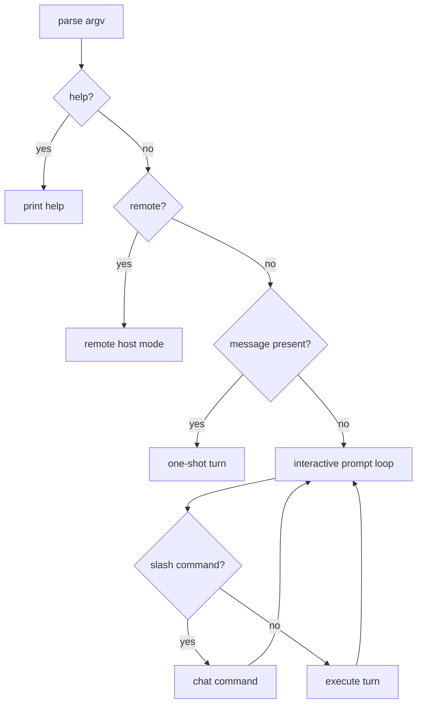

# Plan: Auto Interactive Mode

## Scope

Turn the current no-message error path into a terminal prompt loop while preserving one-shot and remote modes.

## Tasks

- [x] Inspect relevant files
- [x] Make focused changes
- [x] Run validation
- [x] Update docs/status

## Design

Interactive mode belongs in `cli/src/cli-shell.ts` because it is CLI orchestration, not runtime execution. It should reuse `resolveEffectiveAgentConfig`, workspace prompt loading, `loadSkillInventory`, `createTurnExecutor`, and session-store helpers so prompt turns behave like normal CLI turns.

## Implementation Notes

- Add a small interactive prompt abstraction so tests can inject scripted input without a real TTY.
- Create a default readline prompt only when interactive mode is actually selected.
- Keep one `executeTurn` instance per interactive process so runtime settings and prompt layers are stable.
- Track the active chat variable in the loop; update it after `/new`, `/clear`, `/use`, and each completed turn.
- Handle `/exit`, `/quit`, EOF, and readline abort as clean exits.
- Print slash-command feedback to stdout; print turn errors to stderr and continue.
- Do not change parser semantics for message-bearing invocations.

## E2E Coverage

Create `.docs/tests/test-auto-interactive-mode.md` because this changes the user-facing CLI startup flow.

## Validation

- Run TypeScript/build syntax checks.
- Run targeted unit tests for CLI argument and interactive behavior.
- Run the markdown E2E scenarios manually with the built CLI where feasible.

## Status

- Implemented automatic interactive mode for no-message, non-remote invocations.
- Added `/new`, `/clear`, `/chats`, `/use <chatId>`, `/exit`, and `/quit`.
- Added scripted unit coverage for prompt turns and slash commands.
- Validation completed:
  - `npm run test:syntax`
  - `npm run test:unit` (95 unit tests)
  - Manual TTY checks for prompt startup and slash commands from `.docs/tests/test-auto-interactive-mode.md`
  - `node ./bin/agent-cli.js --help`
- Live model E2E turn was not run; unit coverage verifies turn dispatch without external provider dependency.
