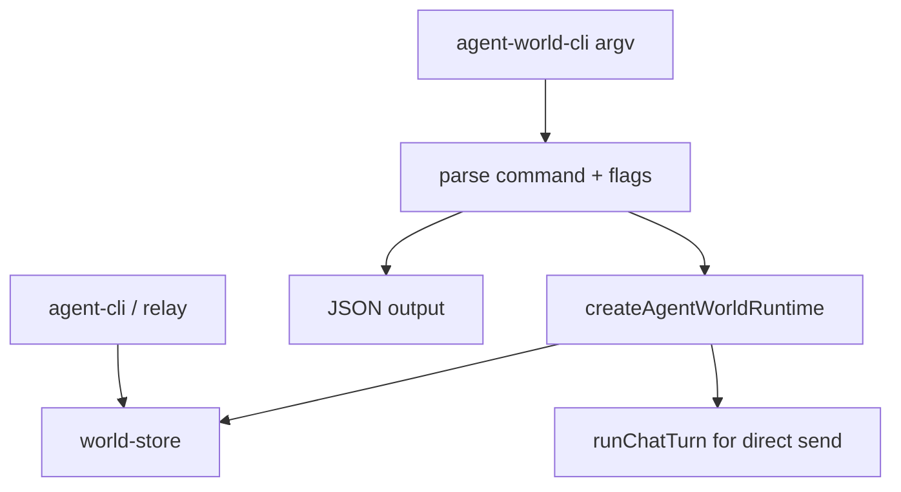

# Plan: Agent World CLI And Store Rename

## Architecture

Rename the overloaded store module to `core/world-store.ts` and update all internal imports to the generated `../../core/world-store.js` ESM path. Keep exported function names stable so existing call sites only pay the import rename cost.

Implement `cli/src/agent-world-cli.ts` as a small command dispatcher over `createAgentWorldRuntime`. The CLI should stay local-first and avoid duplicating runtime behavior: parsing turns flags and positional arguments into world-runtime API calls, and output stays JSON by default for deterministic shell use.

## Tasks

- [x] Inspect relevant files
- [x] Make focused changes
- [x] Run validation
- [x] Update docs/status

## Implementation Notes

- Move `core/session-store.ts` to `core/world-store.ts` and generated `core/session-store.js` to `core/world-store.js`.
- Update imports in CLI/runtime/server/tests and update package syntax checks.
- Rename `tests/unit/session-store.test.js` to `tests/unit/world-store.test.js` and adjust the suite/import labels.
- Implement CLI commands with a minimal parser: no new dependency, no shell-specific output formatting.
- Ensure the queue API has an enqueue-only path for `agent-world-cli send --queue`; direct sends can remain runtime-backed and may require provider credentials.
- Add unit tests that invoke the CLI source in a temporary workspace and verify JSON output/state.
- Add a real-binary E2E test inspired by `../agent-world/tests/electron-e2e`: launch the built entrypoint against an isolated workspace, use helper functions for command execution, and assert durable queue state transitions.

## E2E Coverage

Needed. This story exposes a user-facing binary and changes a shared storage module name. Add a markdown E2E spec covering help/world inspection, local agent/chat operations, queued send, and existing CLI/relay compatibility. Also add executable Vitest E2E coverage for the real `bin/agent-world-cli.js`, following the Electron app E2E pattern of using a real built artifact and isolated workspace.

## Risks

- Renaming the store can miss generated JS paths or syntax-check references.
- Direct `send` commands can accidentally require live provider credentials during tests if tests do not use queue mode.
- A bespoke parser can produce ambiguous errors unless unknown commands and missing arguments are explicit.
- Keeping JSON output stable matters because this CLI is likely to become the smoke-test surface for the world runtime.

## Validation

- `npx vitest run tests/unit/agent-world-cli.test.js tests/unit/world-store.test.js tests/unit/agent-world-runtime.test.js` passed.
- `npx vitest run tests/e2e/agent-world-cli.e2e.test.js` passed.
- `npm test` passed.
- CR passed: no remaining `core/session-store.js` imports, no whitespace errors, and the generated `agent-world-cli` bundle is non-empty.
