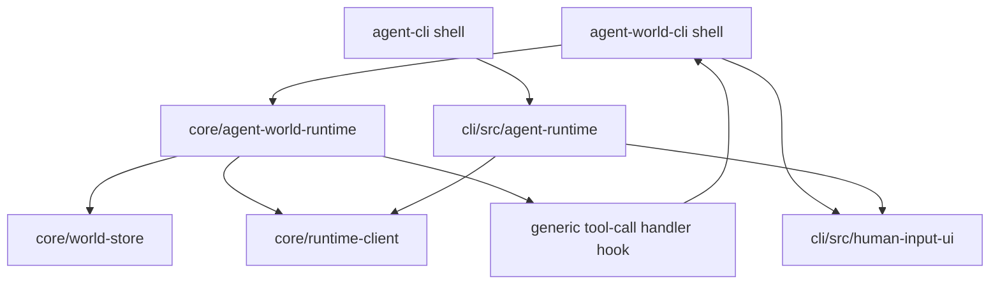

# Plan: Agent World Runtime Boundary

## Architecture

Move the world runtime to `core` because it owns world-domain behavior, persistence orchestration, event emission, queue processing, and message routing. Keep terminal behavior in `cli/src`.

The important boundary is not file movement alone. `core/agent-world-runtime.ts` must remain UI-free. It can expose and call a generic tool-call handler, but `agent-world-cli.ts` decides whether a tool call is `ask_user_input` / `ask_human_input` and how to collect a terminal answer.

## Tasks

- [x] Inspect relevant files.
- [x] Make focused changes.
- [x] Run validation.
- [x] Update docs/status.

## Implementation Notes

- Move `cli/src/agent-world-runtime.ts` to `core/agent-world-runtime.ts`.
- Rewrite imports in the moved file from `../../core/*.js` to local `./*.js` core imports.
- Update `cli/src/agent-world-cli.ts` to import from `../../core/agent-world-runtime.js`.
- Update `tests/unit/agent-world-runtime.test.js` to import from `../../core/agent-world-runtime.ts`.
- Update `package.json` syntax checks to include `core/agent-world-runtime.js`.
- Remove any generated stale `cli/src/agent-world-runtime.js` expectation; the source should no longer exist under `cli/src`.
- Keep `human-input-ui` imports only in CLI-facing files.
- Rebuild generated JS outputs after the move.
- Restore the `agent-cli.ts` entrypoint guard because the earlier source-entrypoint rename made `bin/agent-cli.js` build from a file that no longer invoked `runCli()`.

## E2E Coverage

No new E2E scenario is needed. This is a boundary move. Existing E2E coverage already protects the user-visible behavior:

- provider-free `agent-world-cli` binary coverage
- monitored interactive stdin/stdout coverage
- live flow-matrix coverage for send/edit/delete/HITL

Run those relevant suites after the move.

## Risks

- Relative imports can break after moving from `cli/src` to `core`.
- The CLI bundle can still pass while syntax checks miss the new generated core JS if `package.json` is not updated.
- Accidentally importing `human-input-ui` from core would recreate the boundary violation.

## Validation

- `npm run build` - passed through unit/syntax/relay commands.
- `npm run test:unit` - passed, 11 files / 123 tests.
- `npm run test:e2e:relay` - passed, 4 files / 10 tests.
- `npx vitest run tests/e2e/agent-world-cli-flow-matrix.e2e.test.js` - passed, 1 file / 3 tests.
- `npm run test:syntax` - passed.
- `git diff --check` - passed.
- `rg -n "human-input-ui" core cli/src tests .docs` - only CLI-facing code and docs reference `human-input-ui`.
- `rg -n -- "cli/src/agent-world-runtime|from ['\"]\./agent-world-runtime|from ['\"]\.\./agent-world-runtime|from ['\"]\.\./\.\./cli/src/agent-world-runtime" cli core tests package.json .docs` - no source/test imports of the old runtime path.

## Architecture Review

AR passed: no blocking architecture flaws. The move is correct only for `agent-world-runtime`; `agent-runtime` remains CLI-local because it owns terminal turn presentation and HITL UI adapter behavior.
