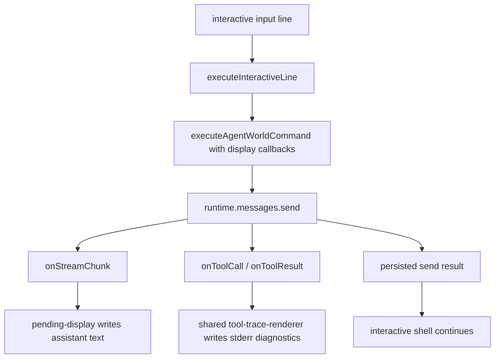

# Plan: Agent World CLI Stream Display

## Architecture

Keep JSON-first one-shot commands unchanged. Add terminal display only at the CLI boundary when the world CLI is running in interactive mode. `core/agent-world-runtime.ts` already forwards stream chunks, tool calls, and tool results into the returned send result; the missing piece is a display callback path from the CLI into `runtime.messages.send`.

The display logic should reuse `cli/src/tool-trace-renderer.ts` for tool diagnostics and `cli/src/pending-display.ts` for stream-safe writes. The world runtime stays transport-neutral; the CLI decides whether to render events.

## Tasks

- [x] Inspect relevant files
- [x] Make focused changes
- [x] Run validation
- [x] Update docs/status

## Targeted Regression Coverage

Needed. This is user-facing terminal behavior in an interactive CLI, but the streaming path depends on provider callbacks. Cover the core behavior with mocked runtime unit tests, and keep provider-free binary checks limited to startup/queue regressions.

## Risks

- Duplicating final assistant text after streaming would make interactive output noisy.
- JSON one-shot commands must remain parseable.
- Tool diagnostics need to clear pending display before writing to stderr.
- Human-input prompts and streamed output must not fight over readline/scripted stdin.
