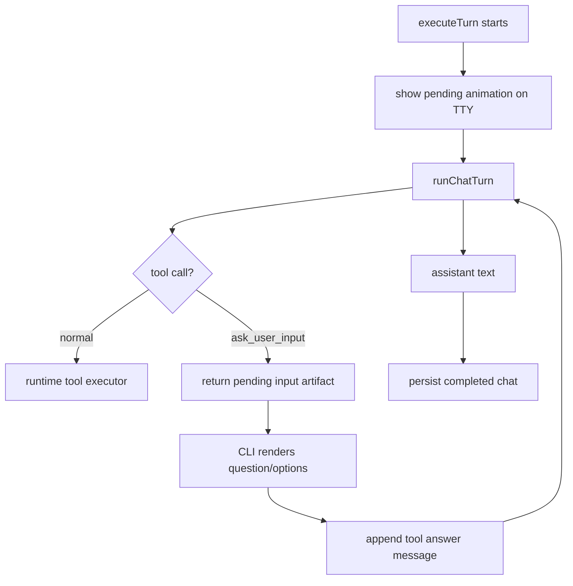

# Plan: CLI Pending And Ask-User Input UI

## Architecture

Keep the work in the CLI runtime boundary. `core/runtime-client.ts` already owns the provider loop and exposes `onToolCall` / `onToolResult`; it also accepts a provided tool executor from the completion loop. The local terminal UI belongs in `cli/src/agent-runtime.ts`, where stdout/stderr/prompt behavior is already mediated.

For `ask_user_input`, intercept only the human-input tool family. For normal tools, keep the existing executor path. For input tools, collect terminal answers during the tool-call handling step, then continue the completion loop with a tool result message. This keeps model-facing history compatible with the existing tool message shape.

## Tasks

- [x] Inspect relevant files
- [x] Make focused changes
- [x] Run validation
- [x] Update docs/status

## E2E Coverage

Needed. This is user-facing terminal data entry. Add a markdown E2E scenario that can be executed with mocked runtime behavior rather than a live provider.

## Risks

- The CLI must not leak animation escape codes into redirected output.
- Input UI cannot assume a single exact payload shape; tool arguments and pending artifacts both need tolerant parsing.
- Continuing after user input must avoid duplicating the original user message.
