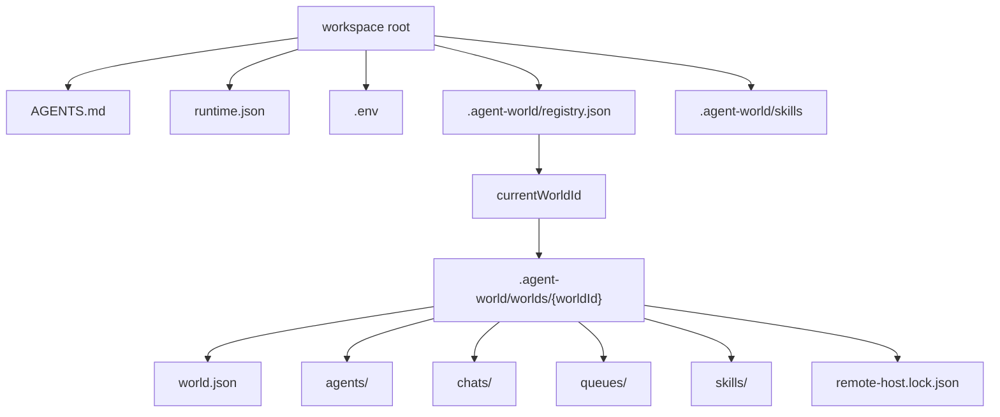

# Plan: Multi-World Workspace API

## Architecture

Introduce a workspace registry/resolver above the existing world store. The workspace owns which worlds exist and which world is selected. The selected world owns the durable operating state currently stored directly under `.agent-world`.

Keep the existing world APIs mostly intact by making path resolution world-aware. `configureWorkspaceRoot` continues to resolve workspace-level resources. A new workspace API resolves the selected world and configures the active world paths before world-store, runtime config, agent runtime, CLI, and remote helpers touch world-owned state.

Skill discovery loads workspace skills first, then selected-world skills. Duplicate `skillId` entries from the world layer replace workspace entries because they are more specific to the active world.

## Tasks

- [x] Inspect relevant files
- [x] Make focused changes
- [x] Run validation
- [x] Update docs/status

## Implementation Notes

- Add `core/workspace-store.ts` for registry bootstrap, world CRUD, active-world resolution, and active-world path configuration.
- Extend `core/paths.ts` with world-aware path roots while preserving exported constants for existing call sites.
- Add `--world <id>` parsing to `agent-cli` and `agent-world-cli`.
- Add `agent-world-cli worlds list|create|use|rename|delete` commands.
- Keep `AGENTS.md`, `.env`, root `runtime.json`, and workspace skills resolved from the workspace root.
- Move world-owned roots to `.agent-world/worlds/{worldId}`.
- Do not implement legacy migration or backwards-compatible singleton paths.
- Update tests to assert the new multi-world paths only.
- Update README and AGENTS storage rules after code behavior is validated.

## E2E Coverage

Needed. This affects user-facing CLI behavior and persisted state isolation. Add a markdown E2E spec for default behavior, explicit world switching, and world-specific skills.

## Risks

- Mutable module-level path exports can leak the wrong selected world if runtime instances for different worlds are used concurrently in one process.
- Runtime config can silently use the wrong default agent if `agent-config` is not updated with selected-world resolution.
- Multi-runtime concurrency inside one process still relies on the existing mutable path module; this change keeps behavior safe for the current CLI and test entrypoints by selecting the active world before world-store operations.

## Validation

- `npm run test:unit` passed on 2026-05-23.
- `npm run test:syntax` passed on 2026-05-23.
- `npm run test:e2e:relay` passed on 2026-05-23.
- `npm run web:typecheck` passed on 2026-05-23.
