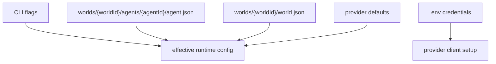

# Plan: Retire Runtime JSON

## Architecture

Collapse runtime configuration into the two durable state objects that already own behavior:

- `world.json`: world-wide runtime defaults such as provider, model, temperature, token limit, tool permission, reasoning, history depth, streaming, stream tracing, and web search.
- `agent.json`: agent identity plus agent-specific runtime settings. Agent settings override the selected world's defaults.

CLI flags remain the top layer. Environment variables remain credentials only.

The old `runtime.json` file path helpers and loader responsibilities should disappear from the active configuration path. `core/agent-config.ts` can keep normalization helpers, but persisted config loading should read `world.json` and `agent.json`.

## Tasks

- [x] Inspect relevant files
- [x] Make focused changes
- [x] Run validation
- [x] Update docs/status

## Implementation Notes

- Update `core/agent-config.ts` so `loadPersistedRuntimeConfig` merges selected-world `world.json` and selected-world `agent.json`.
- Remove root `runtime.json` reads from path/config flow.
- Stop writing agent-level `runtime.json` in `core/world-store.ts`.
- Remove or deprecate `buildAgentRuntimeConfigPath` only if no active call sites remain.
- Update CLI startup/help text and model-missing errors to name `world.json`, `agent.json`, and CLI flags.
- Update tests that currently seed `runtime.json` to seed `world.json` or `agent.json`.
- Update README and AGENTS storage/runtime sections.
- Rebuild generated `bin/` outputs after implementation.

## E2E Coverage

Needed. Runtime config affects user-facing CLI behavior and live-provider setup. Add or update coverage for:

- default world runtime settings used by `agent-cli`
- agent-specific settings overriding world defaults
- CLI flags overriding both
- new-agent creation writing only `agent.json`
- absence of `runtime.json` files after agent creation

## Risks

- Hidden test helpers may still seed `runtime.json`, giving false confidence unless all references are audited.
- Provider/model fallback errors can become misleading if messages still point at `runtime.json`.
- Removing `runtime.json` helpers before call sites are gone can break generated bundles or public core exports.

## AR

AR passed: no blocking architecture flaws.

The split is clear: `world.json` owns defaults for the world, `agent.json` owns agent-specific runtime shape, CLI flags override both, and credentials stay out of config files. The only tradeoff is losing a standalone runtime config artifact, but that is the point of the requirement and reduces duplication.
