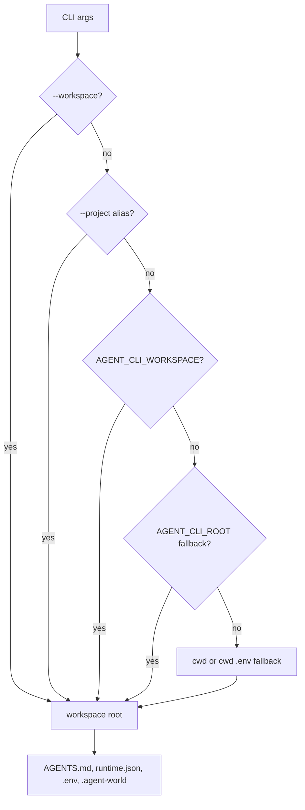

# Plan: Workspace Terminology

## Architecture

The CLI should treat workspace as the canonical name for the loaded root while keeping old project inputs as aliases. This is a naming and compatibility migration, not a storage migration.

## Tasks

- [x] Inspect relevant files
- [x] Make focused changes
- [x] Run validation
- [x] Update docs/status

## Status

- Added canonical `--workspace` and `AGENT_CLI_WORKSPACE` support.
- Preserved `--project` and `AGENT_CLI_ROOT` as compatibility aliases.
- Renamed source terminology around workspace roots and workspace `AGENTS.md` prompt loading while keeping compatibility exports/options where needed.
- Updated README, AGENTS.md, tests, and relevant RPD docs.
- Validation passed: `npm run test:syntax`; `npm run test:unit`; `node ./bin/agent-cli.js --workspace /tmp --help`; `node ./bin/agent-cli.js --project /tmp --help`.

## Implementation Notes

- Rename source-level root APIs and variables where they represent Agent CLI workspace state.
- Preserve exported compatibility names only if tests or nearby code still need them.
- Prefer `--workspace` in help, docs, tests, and examples.
- Keep `--project` and `AGENT_CLI_ROOT` as compatibility aliases with no behavior regression.
- Update generated JS through the normal build path.

## E2E Coverage

No new E2E spec is required. This is a CLI naming and compatibility refactor covered by unit tests and syntax/build checks. Existing remote and CLI e2e suites continue to cover the unchanged runtime behavior.

## AR Review

AR passed: no blocking architecture flaws. The key risk is breaking existing users by removing old inputs; the plan explicitly keeps `--project` and `AGENT_CLI_ROOT` as aliases while making `--workspace` and `AGENT_CLI_WORKSPACE` canonical.
