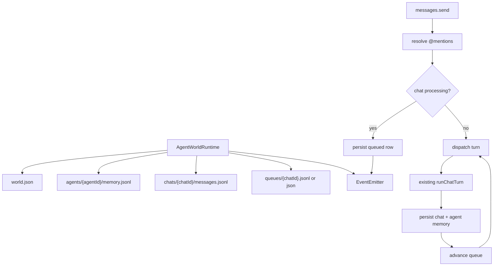

# Plan: World API Runtime

## Architecture

Build a lean world runtime around the existing CLI/runtime pieces instead of porting `../agent-world/core`. The runtime owns a durable world snapshot, in-process event emitter, per-agent memory, per-chat queue state, and `@mention` routing. `agent-runtime` and `runChatTurn` remain the execution engine; the world layer prepares state, calls the existing turn path, persists results, and emits typed events.

Storage stays under `.agent-world`. `world.json` remains the source of truth for `defaultAgentId` and `currentChatId`. Chats remain under `.agent-world/chats/{chatId}` for display/session metadata. Agent-level memory is added under `.agent-world/agents/{agentId}` as structured records with `chatId`, while chat reads can aggregate memory as a read model.

Queueing is per chat and durable. User-authored sends enter the queue only when that chat is already processing or when explicitly added through queue APIs. Direct sends and queued sends share the same dispatch path, mention routing, persistence, and events. Restart recovery is queue-owned: durable `queued` rows auto-resume; recoverable `sending` rows are resolved from transcript/queue state; `error` and `cancelled` rows wait for explicit user action.

## Tasks

- [x] Inspect relevant files
- [x] Make focused changes
- [x] Run validation
- [x] Update docs/status

## Implementation Notes

- Add concrete world-runtime types and implementation in `core/agent-world-runtime.ts`.
- Extend core storage helpers minimally rather than introducing a new backend.
- Add an agent-memory structured file without removing existing `memory.md` compatibility files.
- Keep event payloads stable and typed enough for tests: message, assistant chunk, tool call/result, run lifecycle, chat/agent changes, and queue lifecycle.
- Keep queue dispatch in-process for now; no multi-process locking or registry is required.
- Keep restart recovery deterministic but simple: queue rows own resume authority; chat/memory state is evidence, not the trigger.
- Do not wire the CLI wholesale through the new API unless needed to preserve behavior; direct CLI behavior can remain while the world API is introduced.
- Unsupported broad Agent World features such as import, branching, skill editing, and heartbeat scheduling fail explicitly or return inert empty results in this lean runtime instead of pretending to be implemented.

## Validation

- `npm test` passed on 2026-05-23.
- Scoped world runtime coverage passed through `tests/unit/agent-world-runtime.test.js`.
- Relay E2E coverage passed through `tests/e2e/relay-server.e2e.test.js` and `tests/e2e/agent-cli-remote.e2e.test.js`.

## E2E Coverage

Needed. The story affects user-facing message sending, routed agent behavior, queue/steering behavior, and restart recovery. Add a markdown E2E spec covering world API send/routing, queued steering, restart auto-resume, and preservation of existing CLI commands.

## Risks

- Agent memory and chat display can drift if write paths update one but not the other.
- Multi-mention behavior can accidentally duplicate messages or mutate the default agent.
- Restart recovery can duplicate turns unless queued rows and persisted transcript state are checked carefully.
- Queue stop semantics can be misread as hard cancellation; the API must distinguish pausing/cancelling queued rows from aborting an active model call.
