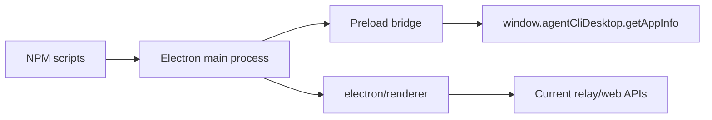

# Minimal Desktop Shell Plan

## Scope

Build a minimal Electron shell with its own renderer under `electron/renderer`. The shell should be a packaging and launch surface, not a port of the legacy Agent World desktop workspace and not a wrapper around the existing `web` app.

## Architecture

## Tasks

- [x] Inspect relevant files
- [x] Make focused changes
- [x] Run validation
- [x] Update docs/status

## Status

Implemented. Validation passed for Electron compilation, packaged-directory generation, the existing root build, and unit tests. Direct GUI launch was not run because it opens a local desktop app.

## Implementation Notes

- Add `electron/` with TypeScript main and preload entry points.
- Use Electron defaults that preserve renderer isolation: `contextIsolation: true`, `nodeIntegration: false`, and `sandbox: true`.
- Load `electron/renderer/index.html` directly in development, start, and packaged modes.
- Keep Electron renderer assets under `electron/renderer`.
- Add a tiny preload API for app metadata only.
- Add root scripts and dependencies without changing current CLI/server/web contracts.

## E2E Coverage Decision

No separate E2E spec for this story. The change is a shell scaffold with build-time validation and a static preload contract. A full interactive E2E becomes useful once desktop-specific behavior or runtime IPC is added.
