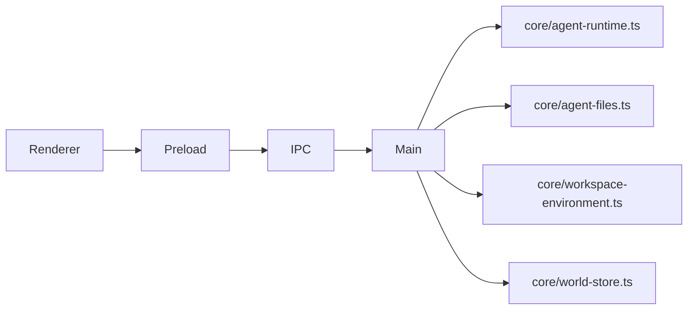

# Electron Runtime IPC Plan

## Approach

Use Electron main as the Node boundary. The renderer calls preload, preload invokes IPC, and main composes the existing core helpers around `runChatTurn` and the flat `.agent-world/chats` store.

## Tasks

- [x] Inspect relevant files
- [x] Make focused changes
- [x] Run validation
- [x] Update docs/status

## Validation

- `npm run electron:build && node --check electron/dist/main.js && node --check electron/dist/preload.cjs && node --check electron/renderer/renderer.js` passed.
- `npm run check` passed.
- `npm run test:unit` passed: 42 tests.
- Browser smoke via `http://127.0.0.1:4179/index.html` passed with no console warnings/errors; IPC is unavailable in plain browser by design.

## Implementation Notes

- Keep runtime execution in Electron main only.
- Expose workspace/chat/message bridge methods from preload.
- Support workspace select, chat list/create/select/load, message send, and edit/resend.
- Pass `toolPermission` and `reasoningEffort` from renderer controls into `agentConfig`.
- Bundle Electron main with esbuild so local TypeScript core imports are included without emitting core as a package.
- Keep preload compiled separately to preserve the existing CommonJS preload output.

## E2E Decision

No E2E spec is required for this change. The current renderer is static and the new bridge can be validated by build/typecheck and unit-free smoke coverage of generated Electron assets. A full UI workflow should get E2E coverage once there is an actual chat UI.

## Architecture Review

AR passed: no blocking architecture flaws. The main risk is provider credentials at runtime; the bridge should fail clearly via IPC instead of hiding setup errors.
