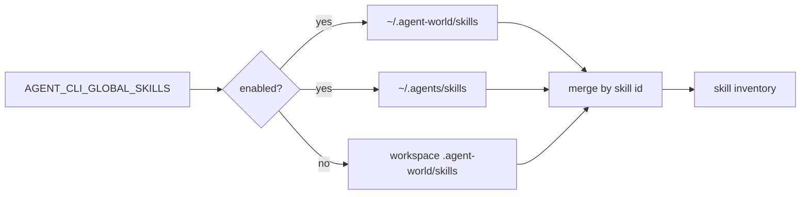

# AP: global-skills-env

## Architecture Decision

Gate only the global roots, not the workspace root. Local `.agent-world/skills` is part of the workspace contract and should stay stable. Home-directory skills are cross-workspace behavior, so they need an explicit opt-in.

Use `AGENT_CLI_GLOBAL_SKILLS` as the environment variable. It matches the existing `AGENT_CLI_*` namespace, can live in `.env`, and is specific enough to avoid implying that workspace skills are optional.

## Tasks

- [x] Inspect relevant files
- [x] Make focused changes
- [x] Run validation
- [x] Update docs/status

## Change Plan

- Add path constants for both global skill roots and a small boolean parser for `AGENT_CLI_GLOBAL_SKILLS`.
- Change `loadSkillInventoryByScope` so `project` always loads and `user` only loads when global skills are enabled.
- Preserve precedence by loading global skills into `user` first and letting `project` overwrite duplicate ids in `flattenSkillInventoryByPrecedence`.
- Add `AGENT_CLI_GLOBAL_SKILLS` to allowed `.env` keys and the generated `.env.example`.
- Update unit tests for default disabled behavior, enabled dual-root behavior, duplicate precedence, and verbose startup diagnostics.
- Update README so the skill-loading contract is visible to users.

## E2E Decision

No new E2E spec. This is configuration-controlled inventory behavior, not a new user-facing flow. Focused unit tests are the right coverage.

## Validation

- `npm run build:core` passed on 2026-05-26.
- `npx vitest run tests/unit/agent-files.test.js tests/unit/paths.test.js tests/unit/agent-cli.test.js` passed on 2026-05-26.
- `npm run build` passed on 2026-05-26.
- `npm run test:unit` passed on 2026-05-26.
- `npm run check` passed on 2026-05-26.

## Risks

- Existing tests may assume user skills always load. Those expectations must change because always-on global loading is the behavior being removed.
- The env parser must avoid accidental enablement from arbitrary non-empty values such as `false`.
- Startup diagnostics should not imply global skills were considered when they were deliberately disabled.
