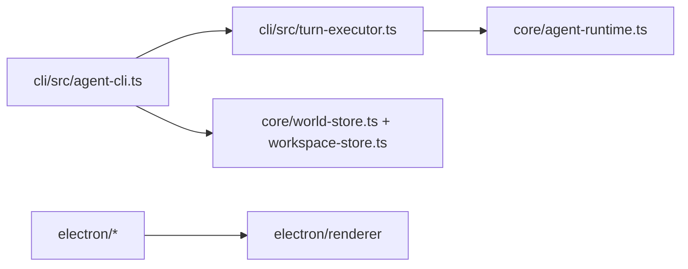
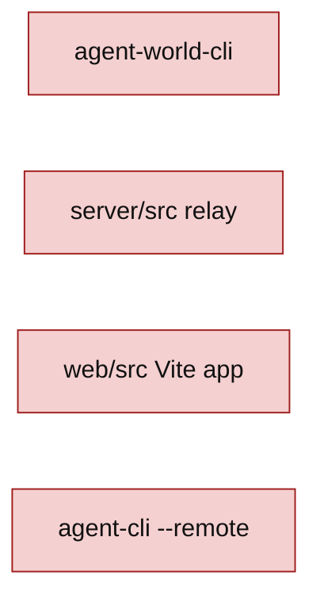

# AP: simplify-project-runtime-cli-electron

## Architecture Decision

Delete the relay/web/Agent World CLI surfaces at the package boundary, not only their folders. A simplified repo that still advertises `agent-world-cli`, `agent-cli-relay`, `--remote`, or web scripts is worse than a large repo because it fails later and less clearly.

The kept shape is:

The deleted shape is:

## Tasks

- [x] Inspect relevant files
- [x] Make focused changes
- [x] Run validation
- [x] Update docs/status

## Change Plan

- Update `package.json` scripts and `bin` entries so the root package only builds/tests the kept CLI/core/Electron surfaces.
- Delete `server/`, `web/`, and `cli/src/agent-world-cli.ts`.
- Remove direct relay/remote imports and `--remote` behavior from `agent-cli`.
- Delete relay, remote, web, and `agent-world-cli` tests that target removed surfaces.
- Update TypeScript configs and README references to match the simplified layout.
- Keep core world runtime/storage modules unless validation proves they are now unreachable dead code and can be removed without expanding scope.

## E2E Decision

No new E2E spec. This is a structural deletion, not a new user-facing flow. Existing local `agent-cli` E2E coverage remains the relevant end-to-end check for the kept CLI surface.

## Validation

- `npm run build` passed on 2026-05-26.
- `npm run test:syntax` passed on 2026-05-26.
- `npm run test:unit` passed on 2026-05-26.
- `npm run electron:build` passed on 2026-05-26.
- `npm run test:e2e` passed on 2026-05-26.

## Risks

- `agent-cli` may have remote code interleaved with local chat flow; remove it carefully instead of leaving dormant branches.
- Tests may import deleted relay utilities indirectly; prune tests by product surface, not by failing filename only.
- README may still contain old remote/web claims after code passes. That would make the simplification incomplete.
