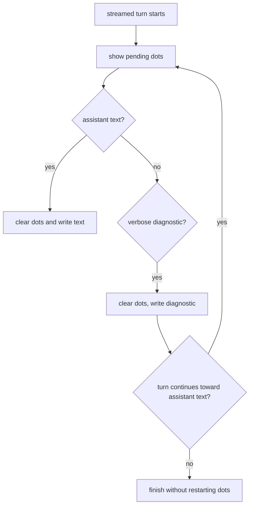

# Plan: Pending Dots Waiting Indicator

## Architecture

Keep the implementation at the CLI turn boundary. `pending-display` should remain a small terminal animation primitive; `turn-executor` owns the product decision about when the assistant is pending. The rule is state-based: streamed turns start waiting, assistant text and prompts clear the frame, and continuation diagnostics resume the frame after they write.

No E2E spec is needed. This is terminal rendering behavior with mocked runtime callbacks, already covered most directly by unit tests.

## Tasks

- [x] Inspect relevant files
- [x] Make focused changes
- [x] Run validation
- [x] Update docs/status

## Targeted Regression Coverage

Use unit tests in `tests/unit/agent-cli.test.js` with mocked `runChatTurn` callbacks:

- Verbose tool diagnostics clear then restart pending dots while waiting continues.
- Verbose model continuation diagnostics restart pending dots.
- Natural-stop verbose model diagnostics do not restart pending dots.
- Existing non-verbose and stream-off tests remain valid.

## Risks

- Restarting dots after final verbose diagnostics would create stray terminal frames.
- Failing to clear before diagnostics would corrupt stderr/stdout boundaries.
- Changing `pending-display` directly would risk non-TTY or stream-off behavior unnecessarily.
