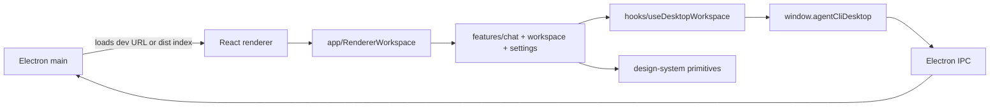

# Electron React Layering Plan

## Approach

Introduce a Vite-powered React renderer while keeping Electron main as the runtime and IPC boundary. Port the existing UI behavior into feature-focused React components and use a lean local design-system layer for reusable primitives. Preserve the existing renderer's visible content, visual styles, and font sizes as the UI baseline.

## Tasks

- [x] Inspect relevant files
- [x] Make focused changes
- [x] Run validation
- [x] Update docs/status

## Implementation Notes

- Add `electron/vite.config.js` and renderer TypeScript configuration for a Vite React renderer rooted at `electron/renderer`.
- Replace the static renderer document with a React root that imports `src/main.tsx`.
- Create `electron/renderer/src` layers: `app`, `constants`, `design-system`, `features`, `hooks`, `types`, and `utils`.
- Consolidate one-use helpers into their owning layers: app shell layout under `app`, settings helpers under `features/settings`, and icons under `design-system/primitives`.
- Keep visible content aligned with the original static renderer; the new structure should not introduce extra sidebar/header/composer/settings labels or controls.
- Preserve the original renderer stylesheet as the visual/font-size baseline while moving behavior into layered React modules.
- Keep the existing IPC bridge API name and request/response shapes so main/preload behavior does not need a broad rewrite.
- Update Electron main to choose a dev server URL when `AGENT_CLI_ELECTRON_RENDERER_URL` is set, otherwise load built renderer assets from `electron/renderer/dist/index.html` with a static fallback during development.
- Update package scripts so `npm run electron:build` builds main/preload and renderer assets.

## E2E Decision

Create a lightweight smoke spec because this is a user-facing Electron UI migration. The spec should verify that the built React renderer loads, initializes the static workspace shell, and keeps key controls present without requiring provider credentials.

## Validation

- `npm run electron:build` passed after the final React renderer, style-preservation, and layer-consolidation changes.
- Built renderer smoke at `http://127.0.0.1:4182/?content-baseline=3` passed: React shell mounted, bridge-unavailable fallback rendered, no added visible workspace button appeared, original search glyph rendered, and browser console reported 0 warnings/errors.
- Smoke style checks confirmed the restored baseline values for the header agent badge and composer: 36px circular agent badge, 13px composer textarea, 12px edit bar, and 36px round send button.
- `npm run check` passed after the final changes.

## Architecture Review

AR passed: no blocking architecture flaws. The main risk is accidental IPC drift while porting DOM code to React; preserving the preload API contract and validating the production renderer build should contain it.