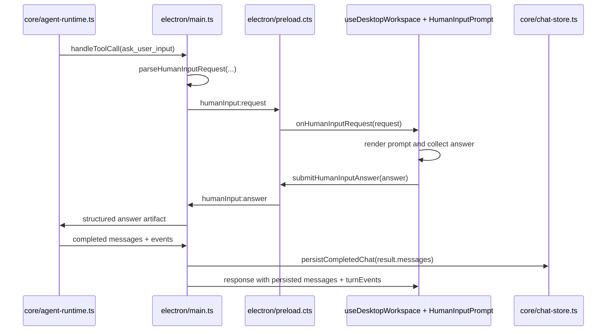

# Plan: Electron Ask User Input UI

## Goal

Electron chat turns must handle `ask_user_input`-style runtime tool calls inside the desktop UI without losing the turn, hiding the request, or polluting persisted chat history with renderer-only activity. The implementation must preserve existing chat send, edit/resend, workspace selection, skill filtering, and hidden-tool-message behavior while exposing useful tool, result, and reasoning activity to the user.

## Current Context

VR inspection verified the current code and docs on 2026-06-03 after SS and CR. No additional builds or tests were run during VR because the latest source-affecting CR changes were already followed by `npm run electron:main:build` and `npm run test:unit`.

- `cli/src/human-input-ui.ts` owns the canonical human-input parser and answer artifact shape. Electron reuses it instead of maintaining a second parser.
- `core/agent-runtime.ts` exposes `handleToolCall`, `onToolCall`, `onToolResult`, `onStreamChunk`, and `onModelResponse` hooks that Electron uses without changing CLI behavior.
- `electron/human-input-session.ts` now owns pending renderer answer state, normalizes request ids before every outcome, generates replacement ids for active request-id collisions, returns structured unavailable answers for missing/destroyed/throwing renderers, times out after 30 minutes, and rejects duplicate or unknown answers.
- `electron/main.ts` imports `parseHumanInputRequest`, uses `HumanInputSessionManager`, creates `humanInput:request` / `humanInput:answer` IPC channels, captures `streamChunks`, `toolCalls`, `toolResults`, and `turnEvents`, and persists only `result.messages` through `persistCompletedChat`.
- `electron/preload.cts` and `electron/renderer/src/types/desktop-api.ts` expose typed human-input request/answer methods plus `turnEvents` on send/edit responses.
- `electron/renderer/src/hooks/useDesktopWorkspace.ts` stores `pendingHumanInputRequest`, subscribes to `onHumanInputRequest`, sets `busyLabel` to `Waiting for input`, submits answers through the preload bridge, clears prompt state after accepted answers, and clears stale prompt state after completed send/edit responses.
- `electron/renderer/src/app/RendererWorkspace.tsx` renders `HumanInputPrompt` between `ChatTranscript` and `ChatComposer`.
- `electron/renderer/src/features/chat/HumanInputPrompt.tsx` uses `human-input-selection.ts`, renders radio controls for `single-select`, checkboxes for `multiple-select`, supports freeform text when allowed, skip when allowed, cancel, and structured answer payloads.
- `electron/renderer/src/features/chat/ChatTranscript.tsx` uses `transcript-events.ts`, renders persisted messages separately from renderer-only `turnEvents`, and hides tool call, tool result, and model-response events when `showToolMessages` is false while retaining ordinary user/assistant messages and reasoning.
- Automated coverage now includes existing CLI/Core human-input runtime tests plus `tests/unit/electron-human-input-session.test.js`, `tests/unit/electron-human-input-selection.test.js`, and `tests/unit/electron-transcript-events.test.js`.
- `.docs/tests/test-ask-user-input-ui.md` now defines the live Electron E2E coverage and points to `npm run test:e2e:electron`.
- `tests/e2e/electron-ask-user-input.e2e.test.js` now launches the real Electron app with Playwright, selects an isolated temp workspace, uses Gemini `gemini-2.5-flash` to emit `ask_user_input`, submits the rendered prompt, verifies same-turn completion, checks hidden tool-message behavior, checks persisted tool output, and confirms renderer-only model-response cards are not persisted after reload.

Current remaining verification gap:

- Live Electron E2E evidence now exists for a real provider-backed turn that emits `ask_user_input`, submits/continues the same turn, verifies hidden-tool-message behavior in the renderer, and confirms persisted chat reload does not keep renderer-only model-response cards.
- Live Electron E2E evidence is still missing for multiple-select, skip, cancel/unavailable cleanup, and actual reasoning/thinking stream visibility.

## Decisions

- Reuse `cli/src/human-input-ui.ts` parsing and answer contracts. Forking an Electron-specific parser would create two truth sources for the same runtime tool.
- Keep runtime execution in `electron/main.ts`. Moving execution into the renderer or adding a remote service violates the local-first Electron boundary and the REQ non-goals.
- Keep prompt state transient in React state only. Do not persist unfinished prompts across restarts, and do not store renderer-only `turnEvents` in chat history.
- Treat timeout/unavailable as a structured tool result, not a renderer crash. The app should clear stale prompt UI once the send/edit call returns even if no renderer answer was accepted.
- Use explicit UI semantics for selection type: radio-style behavior for `single-select`, checkbox behavior for `multiple-select`, and text input only when freeform is allowed.
- Add focused deterministic tests for pure selection and transcript behavior before relying on manual Electron E2E. A live model-driven `ask_user_input` turn is provider-dependent and cannot be the only proof.
- Do not add feature flags, environment variables, compatibility modes, dev-only prompt simulators, fallback services, or generated-output edits for this story.
- Do not broaden scope into general tool approval UX, persisted in-flight turn recovery, provider-specific prompt engineering, or a redesign of the chat shell.

## Phased Tasks

### Phase 1 - Discovery and scope lock

- [x] Inspect `cli/src/human-input-ui.ts` to confirm the canonical request and answer artifact fields that Electron must reuse without introducing a second parser.
- [x] Inspect `core/agent-runtime.ts` to confirm `handleToolCall`, `onToolCall`, `onToolResult`, `onStreamChunk`, and `onModelResponse` still provide the needed Electron integration points.
- [x] Inspect `electron/main.ts` pending-answer flow to confirm how request IDs, renderer timeouts, unavailable renderers, handled tool results, `turnEvents`, and persisted chat messages currently behave.
- [x] Inspect `electron/preload.cts` and `electron/renderer/src/types/desktop-api.ts` to confirm the isolated bridge exposes only typed request, answer, and turn-event data.
- [x] Inspect `electron/renderer/src/hooks/useDesktopWorkspace.ts`, `RendererWorkspace.tsx`, `HumanInputPrompt.tsx`, and `ChatTranscript.tsx` to confirm prompt lifetime, composer busy state, answer submission, transcript rendering, and hidden-tool-message behavior.
- [x] Identify any stale prompt, duplicated parser, persisted renderer-only event, generated-output-only edit, feature flag, or fallback mode that must be changed or rejected according to the REQ.
- [x] Record in this plan that live E2E is required because the story is a user-facing Electron data-entry flow crossing main/preload/renderer/runtime boundaries.

### Phase 2 - Foundation changes

- [x] Add `electron/human-input-session.ts` so request ID generation, timeout cleanup, unavailable-renderer answers, accepted renderer answers, and duplicate/unknown answer rejection are owned by a small testable module instead of ad hoc state inside `electron/main.ts`.
- [x] Update `electron/main.ts` to use `electron/human-input-session.ts` for pending answer lifecycle while keeping runtime execution and IPC registration in the main process.
- [x] Update `electron/renderer/src/hooks/useDesktopWorkspace.ts` so send/edit completion clears any stale pending prompt after timeout, cancellation, unavailable renderer, or normal answer submission without requiring prompt state persistence.
- [x] Keep `electron/preload.cts` and `electron/renderer/src/types/desktop-api.ts` unchanged unless a new serializable lifecycle field is required by the implementation; if changed, update both bridge and renderer type definitions together.
- [x] Add `electron/renderer/src/features/chat/human-input-selection.ts` for deterministic construction of answered, skipped, cancelled, required-answer, single-select, multiple-select, and freeform answer payloads.
- [x] Add `electron/renderer/src/features/chat/transcript-events.ts` for deterministic runtime-event filtering and summary helpers used by `ChatTranscript.tsx`.
- [x] Keep generated output `bin/agent-cli.js` untouched unless an intentional CLI source change requires `npm run build:cli` to refresh it.
- [x] Confirm no new environment variables, feature flags, compatibility aliases, or remote service paths were introduced.

### Phase 3 - Feature implementation

- [x] Update `electron/renderer/src/features/chat/HumanInputPrompt.tsx` to use `human-input-selection.ts` for answer construction and validation.
- [x] Update `electron/renderer/src/features/chat/HumanInputPrompt.tsx` so `single-select` requests present exclusive radio semantics while `multiple-select` requests preserve multi-checkbox behavior.
- [x] Update `electron/renderer/src/features/chat/HumanInputPrompt.tsx` so freeform input is shown only when `allowFreeformInput !== false`, required-answer errors from `human-input-selection.ts` name the unanswered question, and skip remains available only when `request.allowSkip` is true.
- [x] Update `electron/renderer/src/hooks/useDesktopWorkspace.ts` so pending prompt state is cleared after a completed send/edit response when the runtime has already moved past the request, including timeout and unavailable-renderer cases.
- [x] Update `electron/renderer/src/hooks/useDesktopWorkspace.ts` so accepted answer submission clears the prompt without clearing the busy indicator before the runtime turn actually completes.
- [x] Update `electron/renderer/src/features/chat/ChatTranscript.tsx` to use `transcript-events.ts` for event filtering, labels, and summaries.
- [x] Update `electron/renderer/src/features/chat/ChatTranscript.tsx` so reasoning/thinking, tool call, tool result, warning, error, and model-response events render with stable labels, useful summaries, and no replacement of final assistant text.
- [x] Update `electron/renderer/src/features/chat/ChatTranscript.tsx` so `showToolMessages === false` hides tool calls, tool results, and model-response runtime entries while retaining user messages, assistant messages, and reasoning entries.
- [x] Confirm edit/resend, workspace selection, chat selection, skill filtering, tool permission, and reasoning effort request construction still flow through `useDesktopWorkspace.ts` without unrelated behavior changes.

### Phase 4 - Tests and verification wiring

- [x] Add or update `tests/unit/agent-runtime.test.js` coverage proving handled `ask_user_input` tool calls return structured tool-result messages and still emit tool call/result callbacks in the correct order.
- [x] Add `tests/unit/electron-human-input-session.test.js` proving `electron/human-input-session.ts` accepts answered/skipped/cancelled responses, returns unavailable answers for missing renderers/timeouts, and rejects duplicate or unknown request IDs.
- [x] Add `tests/unit/electron-human-input-selection.test.js` proving `human-input-selection.ts` builds single-select, multiple-select, freeform, required-answer, skip, and cancel payloads matching `AgentCliDesktopHumanInputAnswer`.
- [x] Add `tests/unit/electron-transcript-events.test.js` proving `transcript-events.ts` hides tool call/result/model-response entries when requested while preserving user/assistant message visibility and reasoning activity.
- [x] Run `npm run build:core` and record whether TypeScript core compilation passes.
- [x] Run `npm run electron:main:build` and record whether Electron main/preload compilation and bundling pass.
- [x] Run `npm run electron:renderer:check` and record whether renderer TypeScript passes.
- [x] Run `npm run electron:renderer:build` and record whether the Vite renderer build passes.
- [x] Run `npm run test:unit` and record the passing test count or the first failing test with root cause.
- [x] Verify `git diff -- bin/agent-cli.js` is empty unless `cli/src` changed and the CLI bundle was intentionally rebuilt.

### Phase 5 - E2E and manual Electron validation

- [x] Update `.docs/tests/test-ask-user-input-ui.md` so it covers answer submission, skip, cancel/unavailable behavior, visible runtime activity, hidden tool-message behavior, and persistence boundaries.
- [x] Run the executable live Electron scenario in `.docs/tests/test-ask-user-input-ui.md` against a workspace with a valid runtime configuration and record the exact provider/model used.
- [x] Verify the in-app prompt appears during the same busy turn, accepts an option or freeform answer, disappears after submission, and the final assistant response appears without starting a second turn.
- [ ] Verify the skip scenario returns a skipped structured answer and clears the prompt without renderer errors.
- [ ] Verify the cancel or timeout/unavailable path does not leave a stale prompt visible after the runtime turn completes.
- [x] Verify hidden tool-message mode hides tool call/result/model-response entries while preserving ordinary chat messages and reasoning/thinking entries.
- [x] Verify persisted chat reload shows normal user/assistant/tool history but not duplicate renderer-only `turnEvents` cards from the previous live turn.

### Phase 6 - Documentation and status

- [x] Update `.docs/done/2026/06/03/ask-user-input-ui.md` only after fresh validation exists, replacing stale or overbroad claims with exact commands and manual E2E evidence actually collected.
- [x] Update this plan's task checkboxes only after each matching code, test, documentation, or verification action exists.
- [ ] Record final evidence showing every acceptance criterion in `.docs/reqs/2026/06/03/req-ask-user-input-ui.md` is satisfied by current code, tests, E2E checks, or a documented non-goal.
- [x] Leave unrelated staged or untracked work outside the ask-user-input story untouched.

## Validation

Required implementation validation after `SS`:

- `npm run build:core` should complete without TypeScript errors.
- `npm run electron:main:build` should complete without TypeScript or esbuild errors.
- `npm run electron:renderer:check` should complete without renderer TypeScript errors.
- `npm run electron:renderer:build` should complete without Vite build errors.
- `npm run test:unit` should pass, including new or updated human-input lifecycle, renderer selection, transcript filtering, and runtime handled-tool-call coverage.
- `git diff -- bin/agent-cli.js` should be empty unless CLI source changed and the generated CLI bundle was intentionally rebuilt.

Required E2E/manual evidence after `SS`:

- `.docs/tests/test-ask-user-input-ui.md` scenarios must be executed or explicitly marked blocked with the provider/model, workspace path, scenario step, observed result, and expected result.
- At least one live Electron turn must show an `ask_user_input` prompt, submit a structured answer, continue the same turn, and render a final assistant message.
- At least one live Electron turn or deterministic IPC/manual check must prove stale prompts are cleared after skip, cancel, timeout, or unavailable-renderer completion.
- A persisted chat reload must show no duplicate renderer-only activity cards.

AP verification performed:

- Source inspection only; no tests, builds, or Electron app runs were executed during AP.

SS verification performed:

- `npm run build:core` passed.
- `npm run electron:main:build` passed.
- `npm run electron:renderer:check` failed once on TypeScript narrowing in `human-input-selection.ts` and `HumanInputPrompt.tsx`, then passed after explicit `result.ok === false` checks.
- `npm run electron:renderer:build` passed.
- `npm run test:unit` passed: 12 test files, 115 tests.
- `git diff -- bin/agent-cli.js` was empty after `npm run test:unit`; `bin/agent-cli.js` still has a staged pre-existing story diff.
- Manual Electron E2E scenarios in `.docs/tests/test-ask-user-input-ui.md` were not run during SS.

CR verification performed:

- CR found one lifecycle edge: unavailable renderer responses could keep an empty request id when the runtime request had none, and active request-id collisions could overwrite a pending answer.
- Fixed `electron/human-input-session.ts` to normalize request ids before every outcome and generate a replacement id for active collisions.
- Added unit coverage for missing-renderer generated ids and active request-id collisions.
- Reran `npm run electron:main:build`; passed.
- Reran `npm run test:unit`; passed: 12 test files, 115 tests.

Live Electron E2E creation verification performed:

- Added `playwright` as a dev dependency.
- Added `tests/e2e/electron-ask-user-input.e2e.test.js`.
- Added `npm run test:e2e:electron`.
- Added the new E2E file to `npm run check`.
- `node --check ./tests/e2e/electron-ask-user-input.e2e.test.js` passed.
- `npm run electron:build` passed.
- `npm run test:e2e:electron` failed once because the `Alpha route` selector matched both label and description; fixed the selector with exact text.
- `npm run test:e2e:electron` failed once because a live Gemini answer did not match the hard-coded final phrase; fixed the test to assert busy-turn completion plus persisted/rendered assistant output instead of brittle exact text.
- `npm run test:e2e:electron` passed with `GOOGLE_API_KEY` set, provider `google`, model `gemini-2.5-flash`: 1 test file, 1 test.
- `npm run check` passed after adding the Electron E2E syntax check.

VR result:

| Acceptance criterion | Status | Evidence |
| --- | --- | --- |
| Electron shows an in-app prompt for `ask_user_input` instead of failing or dropping the request. | complete | `npm run test:e2e:electron` passed and proved a live Gemini turn emitted `ask_user_input` and rendered `.aw-human-input` in the Electron app. |
| Prompt supports single-select, multiple-select, freeform answers, and skip when allowed. | incomplete | `tests/unit/electron-human-input-selection.test.js` covers single-select, multiple-select, freeform, required-answer, skip, and cancel payloads; `npm run test:e2e:electron` proves rendered single-select submission. Missing live Electron E2E for multiple-select and skip. |
| Submitting the prompt returns a structured tool-result artifact so the same turn continues and persists normally. | complete | `npm run test:e2e:electron` passed and verified prompt submission, busy-turn completion, persisted tool output containing `alpha`, persisted assistant output, and rendered assistant output. |
| Tool calls and tool results are visible with useful names, statuses, summaries, and previews. | complete | `npm run test:e2e:electron` passed and verified the `ask_user_input` tool card appears, can be hidden with the tool-message toggle, and can be restored. Unit tests cover summaries/filtering. |
| Reasoning/thinking stream chunks are visible without replacing final assistant text. | incomplete | `electron/main.ts` records reasoning/thinking chunks as renderer-only `turnEvents`; `ChatTranscript.tsx` renders reasoning cards separately from persisted messages. Missing live Electron E2E proof with an actual streamed reasoning/thinking turn. |
| Existing chat send, edit/resend, workspace selection, skill filtering, and hidden-tool-message behavior continue to work. | incomplete | `npm run test:e2e:electron` verifies workspace selection through the bridge, send, hidden-tool-message behavior, and reload without persisted model-response cards. Missing live Electron E2E for edit/resend and skill filtering. |

VR status: incomplete. The primary live Electron prompt submission path now has executable evidence, but the requirement still cannot fully pass VR until multiple-select, skip, cancel/unavailable cleanup, reasoning/thinking stream visibility, edit/resend, and skill-filtering E2E evidence are executed or explicitly blocked with concrete evidence.

## Rollback / Risk

- The main risk is a turn deadlock: if `electron/main.ts` never resolves a pending answer, the runtime waits until timeout. Keep timeout cleanup explicit and test duplicate/unknown answer handling.
- The second risk is stale UI: if the renderer only clears prompts on accepted submissions, timeout/unavailable completion can leave a dead prompt visible after the turn has moved on.
- The third risk is history pollution: persisting `turnEvents` would duplicate tool/reasoning cards on reload and violate the renderer-only activity decision.
- The fourth risk is misleading selection UX: checkbox controls for single-select can look like multiple selection even when state prevents it.
- Rollback is straightforward because the feature is contained to Electron main/preload/renderer chat paths and RPD docs. Revert the Electron human-input IPC, renderer prompt, transcript activity changes, and matching tests/docs; do not touch CLI/Core human-input behavior unless a shared helper was intentionally changed.

## Architecture Review

AR fixed: replaced the shallow completion checklist with an executable AP tied to verified current code, added explicit stale-prompt and renderer-test gaps, named concrete helper/test targets, expanded validation evidence, and tightened E2E coverage. Rerun result passed: no blocking architecture flaws remain, and SS must not begin until this AP is accepted as the current story plan.
